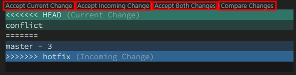

# 2. Branch / Merge / Workflow

> `git branch` / `$ git remote add upstream (원본주소)` `$ git pull upstream master`

- ✍🏻 **Recorded Date** : 2022년 11월 11일 오후 6:46
- 💬 **Comment** : 알찼던 이틀 깃 특강! 덕분에 이렇게 TIL도 매일매일 올릴 수 있게 됐다!😊 틈틈히 깃은 더 공부해보기!
- 🔖 **Notion** : [Notion에서 보기](https://6suk.notion.site/GIT-Branch-Merge-Workflow-5b607b54f6ce4b88a767fb42198ed96d)
   
   

## 🔸 4. Branch

- 브랜치를 통해 **별도의 작업 공간**을 만들고, 그곳에서 되돌리거나 삭제
- 이후 → master에 반영
- **Branch Head** : 현재 브랜치의 **최신 커밋**을 가리키는 포인터

  

### ◽ 4-2. Branch 명령어

| 명령어               | 실행내용                       |
| -------------------- | ------------------------------ |
| git branch           | 생성한 Branch 목록 확인        |
| git branch -r        | 원격 저장소의 브랜치 목록 확인 |
| git branch <name>    | 새로운 name 브랜치 생성        |
| git switch -c <name> | name 브랜치 이동과 동시에 생성 |
| git branch -d <name> | name 브랜치 삭제               |
| git merge            | 브랜치 병합                    |

- ⚠ **브랜치를 이동하기 전** 해당 브랜치의 변경사항 Commit 하는 습관!
- **전체 브랜치를 조회**하는 Git 명령어
  - `git log --oneline --all`
  - `git log --oneline --graph --all` (그래프 형식)

  

## 🔸 5. Branch Merge

⚠️ **HEAD**가 가르키는 브랜치가 합쳐진다. **\*HEAD** 확인하는 습관!

 

### 1️⃣ **Fast - Foward**

 

### 2️⃣ **3 - Way Merge**

 

### 3️⃣ **Merge Conlfict**

- 두 브랜치에서 같은 파일 같은 부분을 수정한 경우 발생하는 충돌 현상
- 직접 내용을 선택 → conflict를 해결해야 함

- 해결 후 **Commit** 작성

  

## 🔸 6. Workflow

### ◽ 6-1. 원격 저장소 소유권이 있는 경우

1. **기능 추가**를 위해 **branch 생성** 및 **기능 구현**
2. 기능 구현 후 **원격 저장소에 브랜치** `push` (master로 옮기지 않고 push)
   - master (master에 영향 없음)
   - branch1
   - branch2
   - branch3
3. **Pull Request** : 반영 요청
   - 실제 소유자가 병합 → 기존 브랜치 삭제
4. master로 head 전환
5. master로 병합된 내용을 \*\*\*\*`pull`
   - 원격 저장소에서 병합 완료된 로컬 branch 삭제

  

### ◽ 6-1. 원격 저장소 소유권이 없는 경우(Forking Workflow)

1. 원본 Repository → `Fork`
2. 내 원격 저장소에 복제 → `clone`
3. `$ git remote add **upstream** (원본주소)`
4. **기능 추가**를 위해 **branch 생성**
5. 기능 구현 후 **‘내 원격저장소’**에 브랜치 반영 → `push`
6. **Pull Request** → 원본 소유주 병합 완료
7. master로 head 전환
8. `$ git pull **upstream** master` → 병합된 내용 `pull`
