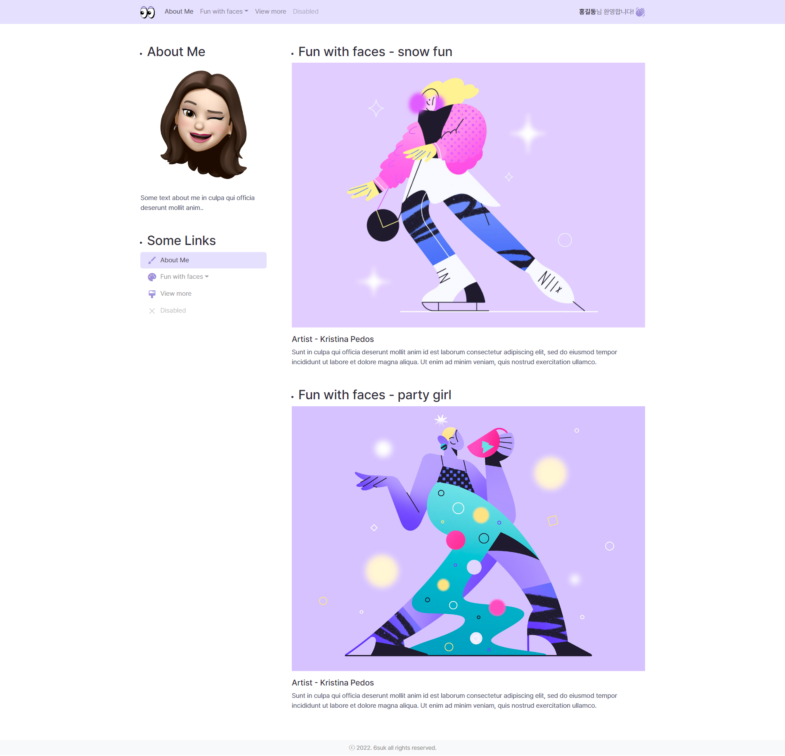
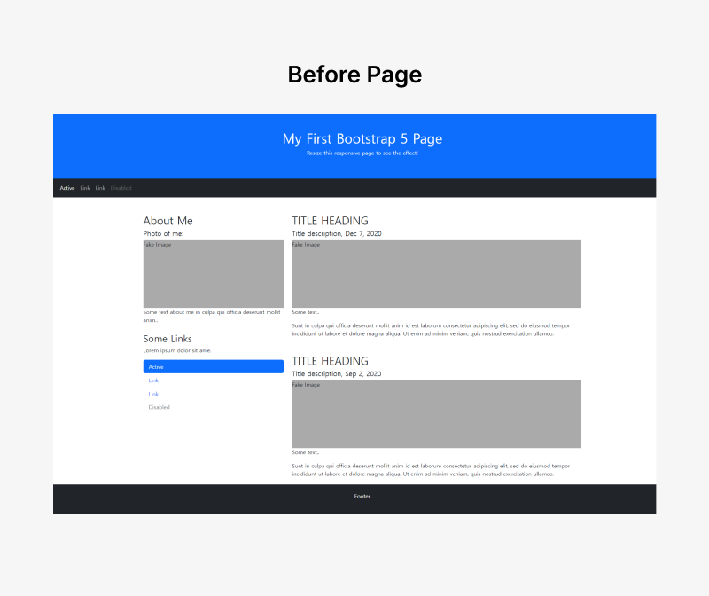
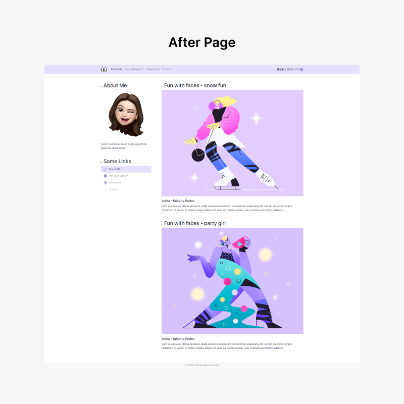

# [🍪Snack Project] - 1시간 스낵 과제

- ✍🏻 **Recorded Date** : 2022년 11월 29일
- [➕ 코드 보러가기](https://github.com/6suk/FrontEndLecture/tree/master/00.SnackProject) / [노션에서 보기](https://6suk.notion.site/Snack-Project-1-cc4842989a3e478c9fed124cd50d0071)
  

 

### ◽ 한시간 과제

부트스트랩의 기본 템플릿에 **기능 추가**하기

- Header 로고 추가
- Header 우측 ‘홍길동님 환영합니다’ 추가
- Nav 드롭다운 추가
- 이미지 삽입
- 아이콘 삽입
- Footer 카피라이트 추가
- (+추가) 전체적인 컬러 변경, 드롭박스 Click 시 디자인 변경

### ◽ Commet

> 아주 간단한 과제를 진행하게 되었다! 
> 짧은 시간에 제작을 해야해서 오래 시간은 못 썼지만 일단 왜인지 **보라색**으로 컨셉을 잡고 싶었다. 
> 전체적인 컬러를 보라색으로 잡고, 로고도 보라색이 들어간 로고로 추가했다. 
> 문제는 Post에 들어갈 이미지인데 [**Kristina Pedos**](https://www.behance.net/13chrisart) 아티스트의 일러스트가 딱이넹..! 
> 어찌저찌 호다닥 마친 과제 제출! 열심히 배우자😉✋🏻

 

 
 

- [Illustration Source : Kristina Pedos](https://www.behance.net/13chrisart)
