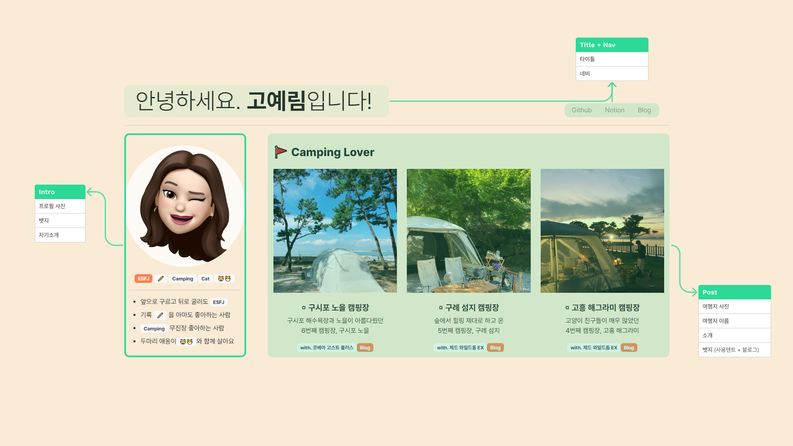
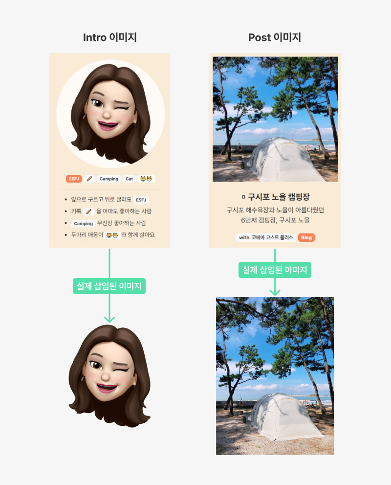
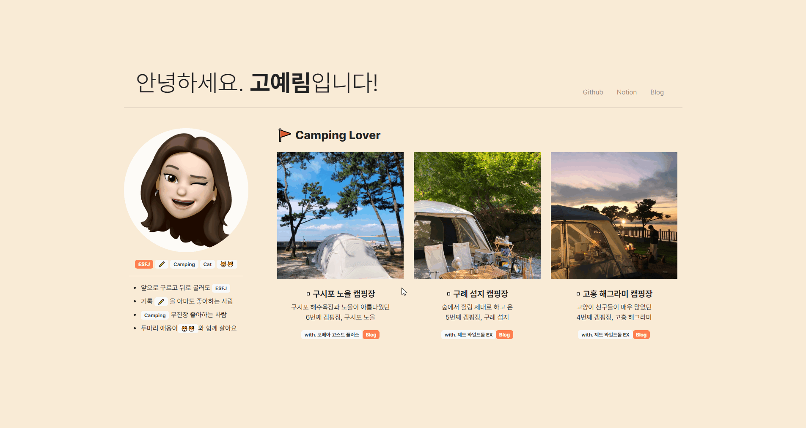

# [⭐Mini Project] - 첫 웹페이지 만들기
> ✍🏻 **Recorded Date** : 2022년 11월 27일 오후 3:24

<br>
<br>

<br>
<br>

## 💬 Comment

지난 주 HTML·CSS를 배우고, 부트스트랩도 함께 배웠다.<br>이번 주말 과제로 ‘**좋아하는 여행지 + 간단한 자기소개**’를 담은 원페이지를 제작하게 되었는데,<br>✏ 나는 아마도.. 기록하는걸 좋아하니까? 허접하지만, 열심히 만든 첫 웹페이지를 기록하기로 했다!<br>무쟈게 즐겁게 만들었다는걸 미래의 내가 알아줬으면..😉<br>
[➕ 코드 보러가기](https://github.com/6suk/FrontEndLecture/tree/master/00.MiniProject) / [노션에서 보기](https://6suk.notion.site/Mini-Project-b7d37b056a2141ef8b9b6131e0f14f32)

<br>
<br>


## 🔸 Page RoadMap (PC ver)


<br>

### ◽ 전체 레이아웃 구성

| 구성 | Bootstrap 5 |
| --- | --- |
| 레이아웃 | Containers |
| 요소 배치 | Grid System |
| 1. Title | Display Headings + Navs |
| 2. Intro | Badges |
| 3. Post | Badges, Grid System |

<br><br>

## 🔸 레이아웃

### ◽ 어려웠던 점

- 브라우저 사이즈가 어떻게 되든 `div.container`가 **수직 중앙 배치** 되기를 원했다.
    - 예를 들면 `그냥 열었을 때`, `F11`을 눌러 브라우저가 전체 사이즈 되었을 때 모두 `수평`, `수직`으로 **중앙 배치** 되는 것을 원했다!
    - 좌우 여백을 동일하게 하는건 쉬운데, **수직을 중앙 배치하는건 도저히 감이 안잡혔다**.
    - 구글링을 해서 ‘`container`’에게 `부모 div`를 만들어주고, `flex`로 잡는 방법이 있다는걸 알게 되었지만 `부모 div`가 **브라우저 높이로 기준을 잡지 않고** 계속 container의 높이로 잡혀 한참 애를 먹었다.

<br>

### ◽ 해결 방법

- 부모 div의 문제가 아닌 body의 문제였다.
- 바디 높이를 브라우저 높이 100%로 설정하는게 맞았다!
- 참고 블로그 : [http://daplus.net/html-바디-높이를-브라우저-높이의-100-로-설정/](http://daplus.net/html-%EB%B0%94%EB%94%94-%EB%86%92%EC%9D%B4%EB%A5%BC-%EB%B8%8C%EB%9D%BC%EC%9A%B0%EC%A0%80-%EB%86%92%EC%9D%B4%EC%9D%98-100-%EB%A1%9C-%EC%84%A4%EC%A0%95/)
- 나는 `body`는 건드리지 않고, `부모 div class`에 `min-heigth`을 넣어 해결했다.

```css
.contentBox {
  min-height: 100vh;
  padding: 0;
  display: flex;
  justify-content: center;
  align-items: center;
}
```

<br><br>

## 🔸 TITLE : Text + Nav


1. Text : `col-md-8` / Nav : `col-md-3`
2. 1번대로 그리드를 잡아도, 끝과 끝으로 배치되지 않는다. 그래서 ↓ CSS를 추가
    
    ```css
    .title {
      align-items: flex-end; /* nav가 안녕하세요 고예림입니다. 글씨 밑을 기준으로 정렬 */
      justify-content: space-between; /* 양 사이드로 배치 */
    }
    ```
    
3. Nav에 추가로 `justify-content-end` 기능을 넣어 끝과 끝에 배치되도록 했다.
    - Nav는 hover 시 색깔이 변하는 기능을 제거하고, 글씨가 굵어지도록 css를 변경했다!

<br><br>

## 🔸 Intro / Post 이미지

인트로와 포스트의 이미지는 ‘원형’, ‘1:1 비율’로 미리 제작한 이미지를 넣지않고,
**내가 어떤 사이즈의 어떤 이미지를 넣어도** 해당 구좌에서 ‘원형’안에 들어가도록, 1:1 비율로 노출되도록 했다.



```css
/* 프로필 이미지 */
.box {
  position: relative;
  overflow: hidden;
  background-color: rgba(255, 255, 255, 0.8);
  border-radius: 70%;
  aspect-ratio: 1/1;
}

#titleimg {
  position: absolute;
  top: 0;
  left: 0;
  width: 100%;
  height: 100%;
  object-fit: cover;
}
```

- box에 백그라운드 컬러를 주고, img를 box안에 배치할 수 있도록 position을 각각 주었다.
- 프로필 이미지는 원형으로 만들거기 때문에 radius를 70% 줬다.
- 1:1 비율로 변환하는 과정에서 이미지가 뭉개지는 상황이 발생했다.
    - 자식에게 `object-fit: cover` 를 해주니 문제가 해결 됐다!

<br><br>

### ◽ `hover` 시 `button` 나타나게 하기

열심히 구글링한 부분..! 더 좋은 방법이 있을지도 모르지만, 일단 내가 구현한 내용은 기록 해두는걸로!



```html
  <!-- row : img -->
  <div class="descbox mb-4">
    <a href="https://blog.naver.com/koandjo_" class="btn btn-new">Post View Now</a>
  </div>
```

```css
.descbox {
  display: flex;
  position: relative;
  overflow: hidden;
  aspect-ratio: 1/1;
  width: auto;
  height: auto;
  align-content: center;
  justify-content: center;
  align-items: center;
  flex-direction: column;
  background-color: rgba(0, 0, 0);
}

#descimg {
  position: absolute;
  width: 100%;
  transition: opacity 0.6s;
}

/* Post 이미지 hover 기능 */

.descbox:hover > #descimg {
  opacity: 0.5;
  transition: opacity 0.6s;
}

.descbox:hover .btn {
  position: absolute;
  opacity: 1;
  transition: opacity 0.6s;
}

.btn {
  opacity: 0;
}
```

<br><br>

## 🔸 반응형 웹사이트

- 부트스트랩의 장점은 반응형이지만, 막상 직접 만들어보니 이것저것 신경쓸 부분이 많았다!
- 그래도 전체적인 font-size, padding, margin을 PC와 동일한 비율로 바뀐다는 점
- 내가 설정한 그리드도 모바일 환경에 맞게 변경 된다는 점은 너무너무 편했다!
- 그 외에 내가 추가로 변경한 내용은 이러하다.
    1. 모바일에선 `Nav`를 **가운데로 정렬**한다.
    2. 모바일에선 Intro 뱃지 하단 `Line`을 **삭제**한다.
    3. **Post의 이미지**를 프로필 이미지처럼 **원형으로 변경**한다.
    4. 이미지의 비율을 조금 더 줄인다.
- 위 `4개 + a` 의 내용은 내가 따로 CSS에 **미디어쿼리**를 추가해 변경했다!

