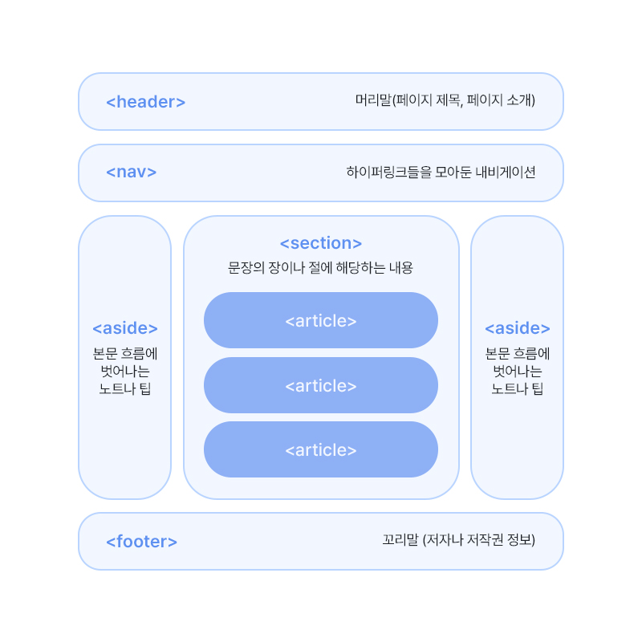

# 2. HTML - 입력 양식 태그
> form / get, post 방식 / name, id

<br>
<br>

- ✍🏻 **Recorded Date** : 2022년 11월 23일 오후 7:57
- 💬 **Comment** : 자바 올리다가 끝날거 같아서 중간중간 지금 배우고 있는 HTML/CSS도 돌아가며 올리려고 한다! 카테고리 하나 더 생기고 아.주. 좋아!😎
- 🔖 **Notion** : [HTML 기본태그](https://6suk.notion.site/1-HTML-9534c7fbaeab4a59ba8677a340ada8f3) / [HTML 입력 양식 태그](https://6suk.notion.site/2-HTML-2b21d64fe5464915ac604e6245f233ef)

<br>
<br>
<br>

## 🔸 HTML5 문서 구조화

### ◽ 공간 분할 태그
- CSS로 원하는 레이아웃을 구성하기 위해 공간 분할

| 태그 | 설명 |
| --- | --- |
| div | 블록 형식으로 공간 분할 |
| span | 인라인 형식으로 공간 분할 |

<br>

### ◽ 시맨틱 태그
- 특정 태그에 의미를 부여한 웹
- **프로그램이 코드를 읽고** 의미를 인식할 수 있는 지능형 웹
    

<br>
<br>

## 🔸 입력 양식
- 사용자에게 정보를 입력 받는 요소

<br>

### ◽ form : 영역 생성

- `method 속성의 방식`으로 `action 속성 장소`에 **데이터 전달**
- `GET` 방식 ⇒ **주소**에 **데이터를 입력**해 전달
- `POST` 방식 ⇒ **주소 변경 없이** 비밀스럽게 데이터 전달

```html
<form action="전송위치" method="전송방식">

<form action="" method="post">
  <input type="text" name="search" >
  <input type="submit" value="제출">
</form>
```
<br>

### ◽ 입력 양식의 종류

| 태그 | 속성 | 설명 |
| --- | --- | --- |
| form | 보이지 않음 | 입력 양식의 시작과 끝 표시 |
| input | text | 글자 입력 양식 |
|  | button | 버튼 |
|  | checkbox | 체크박스 |
|  | file | 파일 입력 양식 |
|  | hidden |  |
|  | image | 이미지 형태 |
|  | password | 비밀번호 입력 양식 |
|  | radio | 라디오 버튼 |
|  | reset | 초기화 버튼 |
|  | submit | 제출 버튼 |
| textarea | cols/rows | 여러 행의 글자 입력 양식<br>cols : 너비 / rows : 높이 지정 |
| select<br>optgroup<br>option |  | 선택 양식 생성<br>옵션 그룹화<br>옵션 생성 |
| fieldset<br>legend |  | 입력 양식 그룹 지정<br>입력 양식 그룹의 이름 지정 |

<br>

### ◽ name / id

- `name` : `서버`에서 입력값을 받을때 `key`값
- `id` : 주로 `자바스크립트`에서 사용

```html
<input type="radio" name="gender" value="male" />남자
<input type="radio" name="gender" value="female" />여자

** Radio button은 name 속성을 같게 입력해야 하나만 선택할 수 있다.
```
<br>

### ◽ Select

- `<optgroup>` `<option>` 태그를 함께 사용
- 한 항목만 선택하기 : `<select>`
- 여러 항목 선택하기 : `<select muliple = “multiple”>`

<br>
<br>
<br>
<br>

