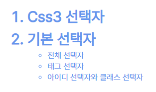
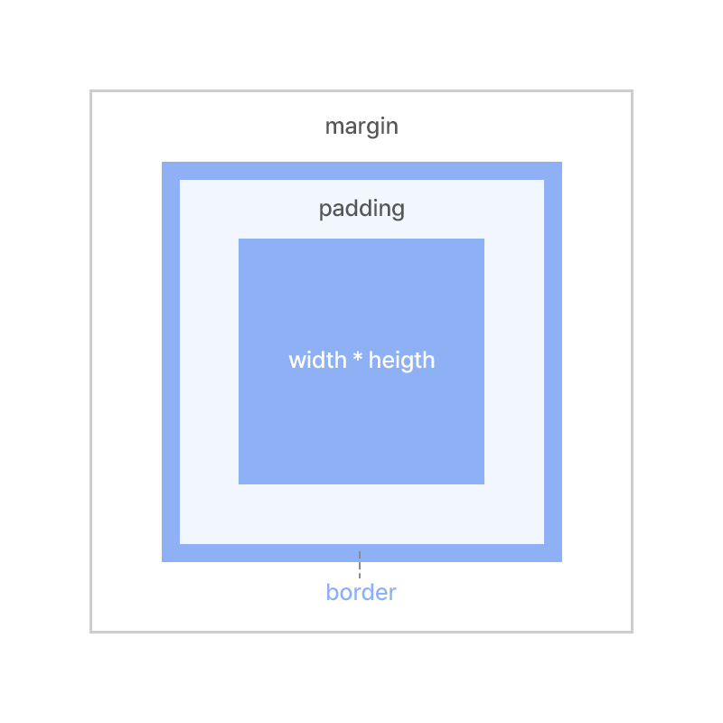
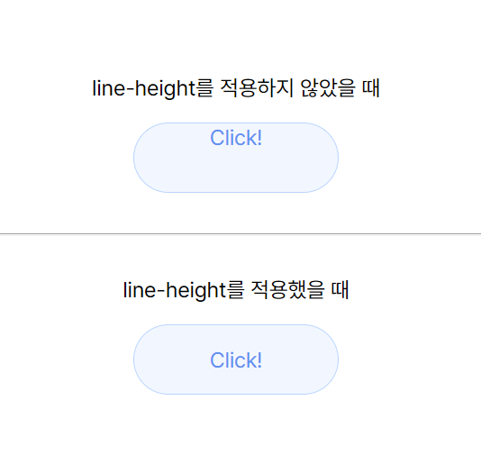

# 3. CSS - 선택자 / 속성
> 기본 선택자 / 후손·자손 선택자 / 박스, 글자 속성

<br>
<br>

- ✍🏻 **Recorded Date** : 2022년 11월 24일 오전 9:09
- 💬 **Comment** : 벌써 수업을 들은 지 한 달이 넘었다!<br>한 달이 호로록 지나갔는데 시험도 보고, 과제도 제출했다.<br><br>시험은 무지하게 쉬웠지만, 100점이라고 뜨는 건 너무 기분 좋으니까 박제해놓기!<br>남은 수업도 지치지 말고 즐기는 걸로!😊
- 🔖 **Notion** : [CSS - 선택자 / 속성](https://6suk.notion.site/3-CSS-86fefbcd631f45fca0ca6a8b43196731) / [CSS - Position / Overflow](https://6suk.notion.site/4-CSS-position-overflow-float-Layout-add22e367c524922a4008882cbfc3d92)

<br>
<br>

## 🔸 CSS

- **선택자** : CSS3에서 특정 HTML 태그를 선택할 때 사용
    
    ```css
    선택자 { 스타일속성 : 스타일 값; }
    h1 { color : red; }
    ```
    
- **스타일 시트** : CSS로 작성된 코드
    
    ```html
    <style>
    	선택자 { 스타일속성 : 스타일 값; }
    </style>
    ```
    

<br><br>

## 🔸 CSS 선택자

- 기본 선택자 / 속성 선택자 / 후손·자손 선택자 / 반응·상태·구조 선택자

<br>

### ◽ 기본 선택자

| 종류 | 형태 | 설명 |
| --- | --- | --- |
| 전체 선택자 | * | HTML 페이지 내부의 태그를 모두 선택 |
| 태그 선택자 | 태그 | HTML 페이지 내부의 특정 태그를 모두 선택 |
| 아이디 선택자 | #아이디 | 특정 id 속성이 있는 태그 선택<br>id속성은 웹 페이지 내부에서 중복되면 안된다는 규정이 있으므로 아이디 선택자는 특정 태그 하나를 선택할 때 사용 |
| 클래스 선택자 | .클래스 | 특정 클래스가 있는 태그 선택 |

<br>

### ◽ 후손 선택자 / 자손 선택자

```css
ol li {
  color: cornflowerblue;
}
ol > li {
  font-size: 30px;
  font-weight: bold;
}
```

```html
<ol>
  <li>Css3 선택자</li>
  <li>기본 선택자</li>
  <ul>
    <li>전체 선택자</li>
    <li>태그 선택자</li>
    <li>아이디 선택자와 클래스 선택자</li>
  </ul>
</ol>
```

<br>

- `a b { ... }`  / `a > b { ... }`
    
    
    | 종류 | 형태 |
    | --- | --- |
    | 후손선택자 | 선택자A 선택자B |
    | 자손선택자 | 선택자A > 선택자B |

- 출력 되는 화면<br>
    
    

<br><br>

## 🔸 CSS 단위

- **키워드 단위** : W3C에서 미리 정의한 단어
- **크기 단위** : `%` / `em` : 배수 단위 / `px`
- **색상 단위** : `rgb(0,0,0)` / `rgba(0,0,0,0)` / Hex `#00994FF`

<br><br>

## 🔸 박스 속성

- `margin`, `border`, `padding`
- **전체 너비 / 높이** = width / height + 2 * (margin + border + padding)
  
        

<br><br>

## 🔸 글자 속성

- `font-size` / `font-family` / `font-style` / `font-weight`
- `text-ailgn`
- `line-height` : 글자 높이 지정
- `text-decoration : none;` : 링크의 밑줄 제거 Click!
    
    

<br><br>

## 🔸 그림자와 그레이디언트 속성
- [CSS3Generator by @RandyJensen](http://css3generator.com/)

<br><br><br><br>