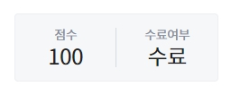
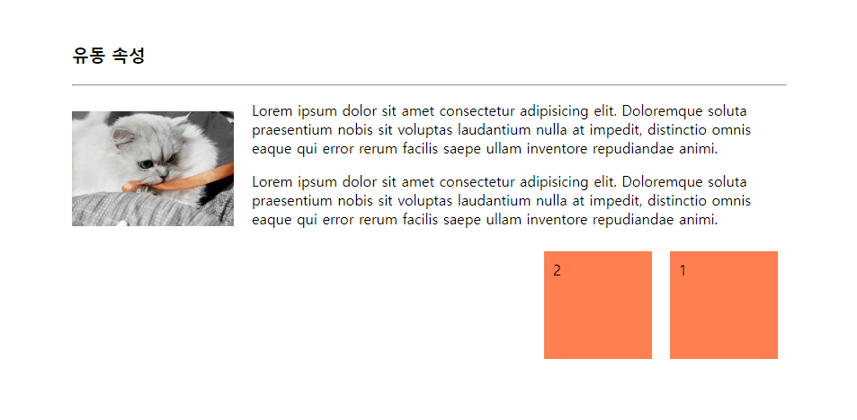
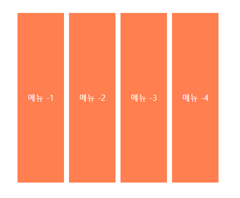
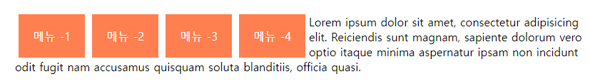

# 4. CSS - position / overflow / float / Layout
> 위치속성 / 유동속성 / 정렬 레이아웃 / 요소배치

<br>
<br>

- ✍🏻 **Recorded Date** : 2022년 11월 24일 오후 4:07
- 💬 **Comment** : 벌써 수업을 들은 지 한 달이 넘었다!<br>한 달이 호로록 지나갔는데 시험도 보고, 과제도 제출했다.<br><br>시험은 무지하게 쉬웠지만, 100점이라고 뜨는 건 너무 기분 좋으니까 박제해놓기!<br>남은 수업도 지치지 말고 즐기는 걸로!😊
- 🔖 **Notion** : [CSS - 선택자 / 속성](https://6suk.notion.site/3-CSS-86fefbcd631f45fca0ca6a8b43196731) / [CSS - Position / Overflow](https://6suk.notion.site/4-CSS-position-overflow-float-Layout-add22e367c524922a4008882cbfc3d92)

<br>
<br>


## 🔸 위치 속성

### ◽ Position - 요소의 위치 지정 형식 설정
- z-index 속성 : 숫자가 클수록 앞에 위치

| 키워드 | 설명 |
| --- | --- |
| absolute | 절대 위치 좌표 설정 |
| fixed | 화면을 기준으로 절대 위치 좌표 설정 |
| relative | 초기 위치에서 상하좌우로 위치 이동 |
| static | 위쪽에서 아래쪽으로 순서대로 배치 |

<br>

### ◽ overflow

- 내용이 요소 크기를 벗어나 모두 보여 주기 힘들 때 어떻게 보여 줄지 지정
- `float` 속성과 함께 자주 사용

| 키워드 | 설명 |  |
| --- | --- | --- |
| hidden | 부모 영역을 벗어나는 부분 감춤 | overflow : hidden; |
| scroll | 부모 영역을 벗어나는 부분을 스크롤로 만듦 | overflow : scroll; |
| overflow-x<br>overflow-y | 특정한 방향으로만 스크롤을 생성할 때 | overflow-y : scroll; |

<br><br>

## 🔸 유동 속성

### ◽ float

- 웹 페이지의 레이아웃을 잡을 때 많이 사용
- **웹 브라우저 크기에 상관없이** 공지 등을 일정한 위치에 고정할 때 적합
    
    
    
    ```css
    img {
          width: 180px;
          float: left;
          margin: 20px 20px 20px 0;
        }
    
    .box {
          width: 100px;
          height: 100px;
          background-color: coral;
          margin: 10px;
          padding: 10px;
          float: right;
        }
    ```
    

<br><br>

## 🔸 수평 /중앙 / One True 정렬 레이아웃 - overflow, float사용

### ◽ 수평 정렬 레이아웃

- **자손에게 float** 속성 지정, **부모의 overflow 속성에는 hidden** 키워드를 적용
    
    ```css
    div.container {
      overflow: hidden;
      }
    div.item {
      height: 300px;
      float: left;
      margin: 0 5px;
      padding: 20px;
      color: #fff;
      line-height: 300px;
      background-color: coral;
    }
    ```
    
    
    

<br>

### ◽ 수평 정렬 레이아웃 - overflow 의 필요성

- overflow 속성을 적용하지 않을 경우
    
    

<br>
  
- overflow 속성을 적용할 경우
    
    
    

<br>

### ◽ 중앙 정렬 레이아웃

- 특정한 너비의 중앙에 내용 위치
- **width 속성을 부여**하고 margin 속성을 ‘`0 auto`’로 입력

<br>

### ◽ One True 레이아웃

- 국내 모든 포털 사이트의 메인 페이지 레이아웃
- 행을 독립적으로 생각해서 공간을 나눔

<br>

### ◽ One True 레이아웃 - 구성하기

1. 행 구성하기
2. 열 구성하기
3. 레이아웃 구성하기
    1. 부모 태그에 고정된 너비 입력
    2. **수평 정렬하는 부모 태그**의 overflow속성 hidden 적용
    3. 자손 태그에 적당한 너비를 입력하고 **float 속성** 적용

<br><br>

## 🔸 요소 배치 - position 사용

### ◽ 절대 위치를 사용한 요소 배치

- **자손**의 position 속성에 `absolute`를 적용하려면
- **부모**의 position 속성에 `relative` 적용 / `height` 속성 입력
    
    ```css
    /* 부모 */
    #container {
      width: 300px;
      height: 300px;
      overflow: hidden;
      position: relative;
    }
    
    /* 자식 */
    .circle {
      position: absolute;
      width: 100px;
      height: 100px;
      border-radius: 50% 50%;
    }
    #a {
      background-color: coral;
      left: 20px;
      top: 20px;
      }
    ```
    

<br>

### ◽ 요소를 중앙에 배치

1. **중앙 정렬하려는** div 태그의 position 속성을 `absolute`로 지정하고 `left` / `top` 속성 50%로 지정
    
    ```css
    #container { position: absolute;
    left: 50%;
    top: 50%;}
    ```
    
2. left / top 50%로 지정
3. 중앙 정렬하려는 div 태그의 margin-left / margin-top 속성에 음수 입력
    - 입력하는 값은 div태그 너비와 높이의 정확히 반이어야 함
        
        ```css
        #container { position: absolute; left: 50%; top: 50%;
        
        margin-left: -250px;
        margin-top: -250px; }
        ```
        
    - `transform` 속성을 이용하는게 더 좋아보임
        
        ```css
        #container { position: absolute; left: 50%; top: 50%;
        
        transform: translate(-50%, -50%);}
        ```
        

<br>

### ◽ 요소를 고정 위치에 배치

1. position 스타일 속성에 `fixed`를 적용
2. left / top / right / bottom 속성에 값을 입력해 위치 설정
3. width / heigth 속성으로 크기 설정

<br><br><br><br>