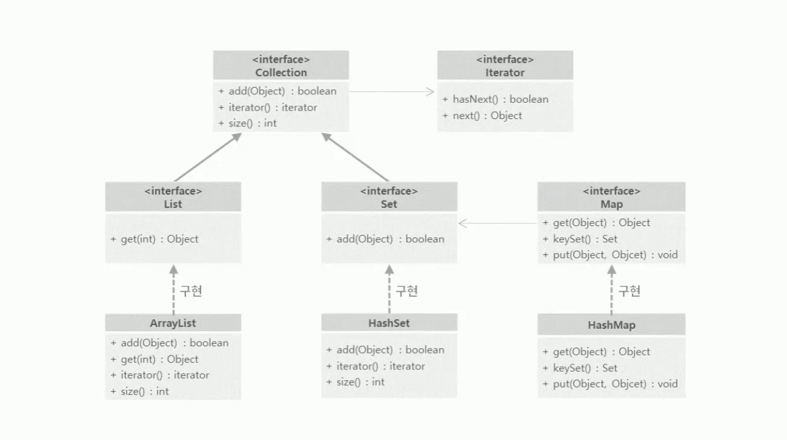

# 16-1. List - ArrayList

> `add(E e)` 중복 O index O `get(int i)`

<br>
<br>

- ✍🏻 **Recorded Date** : 2022년 11월 9일 오후 7:21
- 💬 **Comment** : 컬렉션 프레임워크 필기할 때는 'Hash' / 'Tree'도 헷갈리고,<br>Set / Map도 알쏭달쏭했는데 지금은 어느 정도 깨우친 것 같다.(저 때에 비하면..)<br>역시 난 요령 못 피우는🐣 기록을 열심히 해야 하는 스타일인가 봐..😎📚
- 🔖 **Notion** : [1. List](https://6suk.notion.site/16-1-List-ArrayList-08f670d3aabe4254a37880c00ea436cd) / [2. Set](https://6suk.notion.site/16-2-Set-HashSet-TreeSet-176824472d0e4910918f7e531c3159ec) / [3. Map](https://6suk.notion.site/16-3-Map-HashMap-TreeMap-832674f39e5547538405fa57f58e53b5)

<br>
<br>
<br>

## 🔸 컬렉션 프레임워크



<br>
<br>

## 🔸 1. List ( Index )

> ArrayList / Vector / LinkedList

<br>

| 기능      | 타입    | 메소드             | 설명                                      |
| --------- | ------- | ------------------ | ----------------------------------------- |
| 객체 추가 | boolean | add(E e)           | 객체를 맨 끝에 추가                       |
|           | void    | add(Int i, E e)    | 주어진 인덱스에 객체를 추가               |
|           |         | set(int i, E e)    | 주어진 인덱스의 객체를 새로운 객체로 교체 |
| 객체 검색 | boolean | contains(Object o) | 주어진 객체가 저장되어 있는지 여부        |
|           | E       | get(int i)         | 주어진 인덱스에 저장된 객체를 리턴        |
|           | boolean | isEmpty()          | 컬렉션이 비어있는지 조사                  |
|           | int     | size()             | 저장되어있는 전체 객체 수를 리턴          |
| 객체 삭제 | void    | clear()            | 저장된 모든 객체를 삭제                   |
|           | E       | remove(int i)      | 주어진 인덱스에 저장된 객체를 삭제        |
|           | boolean | remove(Object o)   | 주어진 객체를 삭제                        |
|           | int     | indexOf(E e)       | 값을 제공하면 해당 값의 인덱스 반환       |

<br>

- `sort` : 클래스 타입일 경우, comparator를 이용해 정렬 가능
  ```java
  List<Member> list2 = new ArrayList<>();
  list2.add(new Member("고뚱이", 7));
  list2.add(new Member("고뚱이", 7));
  list2.add(new Member("고시케", 2));
  list2.add(new Member("정현철", 30));

  /**나이순 정렬*/
  list2.sort((x,y)-> x.age - y.age);
  list2.forEach(a -> System.out.println(a));

  // 출력
  // Member [name=고시케, age=2]
  // Member [name=고뚱이, age=7]
  // Member [name=고뚱이, age=7]
  // Member [name=정현철, age=30]
  ```

<br>
<br>

### ◽ 1-1. ArrayList

- 가장 많이 사용되는 자료 구조 중 하나
- 인덱스로 내부의 객체 관리 → 자동으로 부족한 크기만큼 저장용량이 늘어남

<br>

### ◽ 1-2. Vector

- 멀티 스레드 환경에서 안전하게 객체를 추가/삭제

<br>

### ◽ 1-3. LinkedList

- 객체 삽입/삭제가 잦은 자료에서 사용
- 중간에 데이터를 insert를 해야할 경우가 많다면 ArrayList보다는 LinkedList를 활용

<br>

---

<br>

## 🔸 Iterator

```java
Set<E> set = new HashSet<>;
Iterator<E> iter = set.iterator();

while(iter.hasNext()){
	E e = iterator.next();
	System.out.println(e);
}
```

| 리턴타입 | 메소드명  | 설명                                                    |
| -------- | --------- | ------------------------------------------------------- |
| boolean  | hasNext() | 가져올 객체가 없으면 false 리턴 (보통 while문에서 사용) |
| E        | next()    | 컬렉션에서 하나의 객체를 가져온다.                      |
| void     | remove()  | next()로 가져온 객체를 Set 컬렉션에서 제거한다.         |
