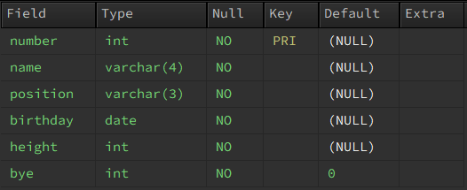

# [Mini Project] - JDBC / BaseballPlayer

- ✍🏻 **Recorded Date** : 2022년 10월 31일 오후 11:06
- 💬 **Comment** : 오늘 JDBC를 배우고 직접 DB와 Java를 연결해
  작은 프로그램을 만드는 실습을 했다! 너무너무 재밌어서 당장 기록해버리깃😎
  나중에 보면 우스울수도 있지만ㅋㅋㅋㅋ ‘기록’에 의미를 두는것으로~😉
- 🔖 **Notion** : [JDBC 필기 내용 보기](https://www.notion.so/213645b5dd08427094f3f0e4947c5126) / [노션에서 보기](https://6suk.notion.site/Baseball-player-3b83ad82d92946789fba9d2452c83517)
- ➕ **[Git hub Code View](https://github.com/6suk/JavaLecture/tree/master/src/mysql/baseballPlayer)**

<br><br>

## 🔸 과제 내용

1. 좋아하는 프로야구 구단의 선수를 등록하려고 한다.
2. 등록하려는 정보는 선수명, 백넘버, 포지션, 생년월일, 키(height)
3. primary key는 백넘버로 한다.
4. 각 포지션(투수, 포수, 내야수, 외야수) 별로 3명 이상의 선수를 등록한다.
5. 선수 목록, 선수 등록, 선수정보 수정, 선수 방출할 수 있는 App 만들기

<br>

## ➕ 기능 추가하기

위 내용처럼 4가지 기능만 만들면 됐지만, 방출된 선수들 다시 데리고 오고 싶으면 어쩌죠..? 😢<br> 난 그래서 **[ 5. 선수 재입단 ]** 기능과 **[ 목록 되돌아가기 ]** 기능도 넣어 보았다.

<br><br>

## 🔸 1. Table 생성

- 가장 먼저 `bplayer` 테이블을 생성했다.
- 선수 방출 시, Table에서 바로 삭제하지 않고 `bye` field를 `1`로 바꿔 선수 조회 시 검색 되지 않게 할거다.<br><br>
  

<br><br>

## 🔸 2. DTO 생성

- 생성된 필드를 바탕으로 `Player Class`의 필드를 채워넣었다.

  ```java
  private int num;
  private String name;
  private String position;
  private LocalDate bDay;
  private int height;
  private int bye;
  ```

- 총 3개의 **생성자**와 **getter, setter**를 생성했다.
  1. **선수 등록용** 생성자 : 백넘버, 이름, 포지션, 생년월일, 신장 입력
  2. **선수 수정용** 생성자 : 이름, 포지션, 신장만 변경할 수 있도록
  3. 전체 필드가 들어있는 생성자

<br><br>

## 🔸 3. DAO 생성

- DAO에 내 `DB` → `TABLE`과 연결하고, JAVA와 SQL을 주고 받을 수 있도록 세팅한다.
- 또 DB에 **입력, 조회, 수정**할 수 있는 각각의 메소드를 구현했다.
- [DAO 코드 보러가기](https://github.com/6suk/JavaLecture/blob/master/src/mysql/baseballPlayer/DAO.java)<br>

  

<br><br>

### ◽ 1. DAO - 선수 목록

- **공통**
  - 각 용도별 SQL문을 작성해 DB에 넘긴다.
  - `ResultSet executeQuery` 를 통해 DB에서 받아온 데이터를 출력하도록 했다.

1. **전체 선수 목록**
2. **방출된 선수 목록** : 선수 재입단 시 ‘방출된 선수’들을 확인하는 목적

   - 매개 변수 없이 ‘기본’으로 출력될 목록이기 때문에 `Statement` 객체를 생성했고,
   - DB에 전송될 SQL문

   ```sql
   // 전체 선수 목록
   SELECT * FROM bplayer WHERE bye = 0
   ORDER BY FIELD(POSITION,'투수','포수','내야수','외야수');

   // 방출된 선수 목록
   SELECT * FROM bplayer WHERE bye = 1
   ORDER BY FIELD(POSITION,'투수','포수','내야수','외야수');
   ```

3. **특정 선수의 목록**

   - 선수의 백넘버를 인자로 받아 넘겨야하기 때문에 `PreparedStatement` 객체를 이용했다.
   - DB에 전송될 SQL문

   ```sql
   "SELECT * FROM bplayer WHERE number = ?;"
   ```

<br>

---

<br>

### ◽ 2. DAO - 선수 등록

- Player 타입의 매개변수를 넘겨 받아 `PreparedStatement` 객체를 통해 테이블에 추가하도록 했다.
- DB에 전송될 SQL문
  ```sql
  INSERT INTO bplayer VALUES(?, ?, ?, ?, ?, 0);
  ```
  <br>

---

<br>

### ◽ 3. DAO - 선수 정보 수정 / 방출 / 재입단

- DB에 전송될 SQL문

  ```sql
  // 선수 정보 수정
  UPDATE bplayer SET `name` = ?, `position` = ?, height = ? WHERE number = ?;

  // 선수 방출
  UPDATE bplayer SET `bye` = 1 WHERE NUMBER = ?;

  // 선수 재입단
  UPDATE bplayer SET `bye` = 0 WHERE NUMBER = ?;
  ```

<br>

---

<br>

## 🔸 4. 메인 앱 작성

- [Main App 코드 보러가기](https://github.com/6suk/JavaLecture/blob/master/src/mysql/baseballPlayer/playerMainApp.java)
- 입력은 `BufferReader`로 받고 모든 메소드에서 `br.readline()` 로 편하게 쓸 수 있도록
  `public static`객체를 생성했다. ( DAO도 마찬가지로! )<br>

  

<br><br>

### ◽ 0. 초기 화면 (메인 화면)

- 각각의 기능들이 구현될 수 있도록, switch문을 사용해 메소드를 실행하도록 했다.

```java
public static void main(String[] args) throws IOException {
		boolean run = true;
		while (run) {
			System.out.println("-----------------------------------------------------------------------");
			System.out.println("  1.선수목록 | 2.선수등록 | 3.선수수정 | 4.선수방출 | 5.선수재입단 | 6.종료 ");
			System.out.println("-----------------------------------------------------------------------");
			System.out.print("  - 선택 > ");
			int selectNo = Integer.parseInt(br.readLine());
			System.out.println();

			switch (selectNo) {
			case 1:
				playerList();
				break;
			case 2:
				newPlayer();
				break;
			case 3:
				updatePlayer();
				break;
			case 4:
				byePlayer();
				break;
			case 5:
				welcomePlayer();
				break;
			case 6:
				System.out.println("  [프로그램 종료]");
				br.close();
				run = false;
				break;
			default:
				System.out.println("  [오류] : 1에서 5까지의 숫자만 입력하세요!");
			}
		}
	}
```

- 가장 처음 나오는 화면<br>
  

- 잘못된 숫자를 입력할 경우<br>
  

- 프로그램 종료를 선택한 경우 ( ‘6’ 입력 시)
  

<br>

---

<br>

### ◽ 1. 선수 목록

- DAO에서 만들어 놓은 `.getPlayerList()` 실행 → List를 받아 `foreach`문으로 출력된다.

```java
// Main - 01 playerList Method
	public static void playerList() {
		System.out.println("-------------------------------------");
		System.out.println("  ▶ 선수목록");
		System.out.println("-------------------------------------");
		List<Player> player = dao.getPlayerList();
		player.forEach(x -> System.out.println("  " + x));
		System.out.println();
	}
```

- 조금 신경 쓴 부분이 있다면 처음 DTO 작성 시 `toString`을 오버라이드 했는데,
- `String fomat`을 이용해서 보기 편하게 출력되도록 했다.

```java
// Player - @Override toString
@Override
public String toString() {
	return String.format("  %-4d | %-6s | %-6s | %s | %-3d", num, name, position, bDay, height);
}
```

- 선수 목록 선택 시 (’1’입력)<br>
  

<br>

---

<br>

### ◽ 2. 선수 등록

- 가장 먼저 백넘버를 입력 받고, DAO의 `getPlayer()`를 이용해 **중복된 백넘버**가 있는지 찾는다.
- 중복된 백넘버가 없다면, 선수이름 → 포지션 → 생년월일 → 신장을 입력한다.
- Player 객체로 묶어 DAO의 `setPlayer()`에게 넘겨준다.
- 그럼 선수 등록 완료! 등록이 완료되면 DAO `setPlayer()` 가 등록 완료 되었다는 메세지를 출력해준다.
- 선수등록 화면 ↓<br>
  
  

- 여기서 신경쓴 부분은 `‘되돌아가기 0번’`이다.
  - 그냥 내가 필요해서 추가했다…🤣
  - 0은 어디에도 입력될 일이 없어서 0번으로 정하고, `0`이 입력되면 `return`
  - **초기화면으로** 돌아가도록 했다.
  - 되돌아가기 화면 ↓<br>
    

<br>

---

<br>

### ◽ 3. 선수 수정

- 선수를 수정하기 전 등번호를 입력하면 ‘기존정보’ 가 뜰 수 있게 DAO의 `getPlayer()` 메소드를 이용했다
- 처음에 만들었을 때는 값을 꼭 입력했어야했는데 안바꾸고 싶은 데이터도 자꾸 입력해야해서 귀찮았다.
- 강사님이 알려주신대로 **삼항연산자를 이용**해서 “” 공백이 들어오면 **기존 데이터 그대로 넣도록** 코드를 바꿨다.
- 중간중간 강사님의 꿀팁 덕분에 더 재밌었다 증말~🤣<br>
  

<br>

---

<br>

### ◽ 4. 선수 방출

- 선수 방출을 누르면 방출할 수 있는 **선수들의 리스트가 출력**되게끔 했다.
- 방출 후에는 **“[선수 이름]가 방출되었습니다.”** 라는 메세지가 뜨도록 DAO `byePlayer()` 메소드에 설정해놨다.<br>
  

<br>

---

<br>

### ◽ 5. 선수 재입단

- 선수 재입단을 선택하면 ‘방출된 선수 명단’이 출력되고
- 재영입할 선수 등번호를 입력하면 **“[선수 이름]가 재입단했습니다.”** 라는 메시지가 뜬다.
- DAO에서 `welcomPlayer()` 메소드를 이용했다.<br>
  
