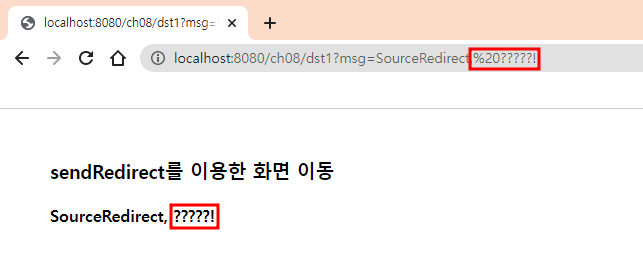
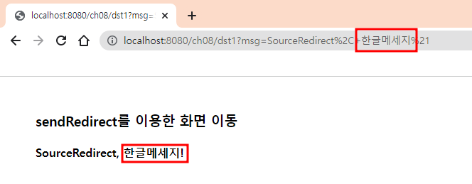

# 7. Servlet - Encoder / Decoder
> `URLEncoder.encode()` / `URLDecoder.decode()`

<br><br>

- ✍🏻 **Recorded Date** : 2022년 12월 12일
- [노션에서 보기](https://6suk.notion.site/7-Servlet-Encoder-Decoder-fb9de8c6de034df1bdb90ed2d034196f?pvs=4)

<br><br>

## 🔸 Servlet으로 한글 주고받기

- **GET 방식**으로 주고 받을 땐 인코딩/디코딩이 필요하다.
- `/ch08/dst1?msg=한글메세지`

<br>

### ◽ Encoding ❌ / Decoding ❌

- Servlet

```java
/** Send Sevlet */
System.out.println("/ch08/src1 doGet()");
String msg = "SourceRedirect, 한글메세지!";
response.sendRedirect("/ch08/dst1?msg=" + msg);

/** Dest Sevlet */
request.setCharacterEncoding("utf-8");
String msg = request.getParameter("msg");
out.print("<h3>sendRedirect를 이용한 화면 이동</h3>");
out.print("<h4>" + msg + "</h4>");
```

- Console

```bash
/ch08/src1SourceRedirect, 한글메세지! # send
/ch08/dst1SourceRedirect, ?????! # Dest
```

- Web
<br>

<br><br>

### ◽ Encoding ⭕ / Decoding ❌

- Servlet

```java
/** Send Sevlet */
System.out.println("/ch08/src1 doGet()");
String msg = "SourceRedirect, 한글메세지!";
msg = URLEncoder.encode(msg, "UTF-8"); // 인코딩
response.sendRedirect("/ch08/dst1?msg=" + msg);

/** Dest Sevlet */
request.setCharacterEncoding("utf-8");
String msg = request.getParameter("msg");
out.print("<h3>sendRedirect를 이용한 화면 이동</h3>");
out.print("<h4>" + msg + "</h4>");
```

- Console

```bash
/ch08/src1SourceRedirect%2C+%ED%95%9C%EA%B8%80%EB%A9%94%EC%84%B8%EC%A7%80%21 # send
/ch08/dst1SourceRedirect, 한글메세지! # Dest
```

- Web
<br>

<br><br>

### ◽ Encoding ⭕ / Decoding ⭕

- Servlet

```java
/** Send Sevlet */
System.out.println("/ch08/src1 doGet()");
String msg = "SourceRedirect, 한글메세지!";
msg = URLEncoder.encode(msg, "UTF-8"); // 인코딩
response.sendRedirect("/ch08/dst1?msg=" + msg);

/** Dest Sevlet */
request.setCharacterEncoding("utf-8");
String msg = request.getParameter("msg");
msg = URLDecoder.decode(msg, "UTF-8");
out.print("<h3>sendRedirect를 이용한 화면 이동</h3>");
out.print("<h4>" + msg + "</h4>");
```

- Console

```bash
/ch08/src1SourceRedirect%2C+%ED%95%9C%EA%B8%80%EB%A9%94%EC%84%B8%EC%A7%80%21 # send
/ch08/dst1SourceRedirect, 한글메세지! # Dest
```

- Web
<br>

<br><br><br><br>