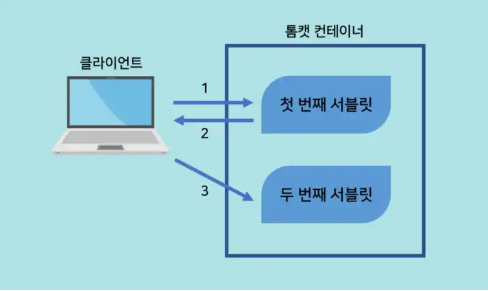
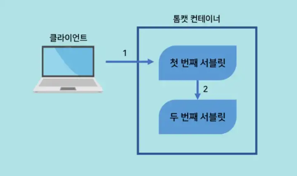

# 6. Servlet - forward
> Redirect `sendRedirect()` / Dispatch `RequestDispatcher dis = request.gerRequestDisPatcher()`

<br><br>

- ✍🏻 **Recorded Date** : 2022년 12월 12일
- [노션에서 보기](https://6suk.notion.site/6-Servlet-foward-5734cc67cda44bab80b44fe74e7d8d1a?pvs=4)

<br><br>

## 🔸 포워드(forward)란?

- 하나의 서블릿을 다른 서블릿이나 JSP와 연동하는 방법
- 요청에 대한 추가 작업을 다른 서블릿이 수행
- 요청에 포함된 정보를 다른 서블릿이나 JSP와 공유한다.
- 요청에 정보를 덧붙여 다른 서블릿으로 전달한다.
- 모델 2 개발 시 서블릿에서 JSP 로 정보를 전달한다.

<br><br>

### ◽ ⭐ Redirect

- 서블릿의 요청이 클라이언트의 브라우저를 거듭 거쳐 요청되는 방식

<br>

1. 첫번째 서블릿이 요청을 받고,
2. sendRedirect() 메서드를 이용해 브라우저에게 두 번째 서브릿으로 재요청하도록 하면,
3. 브라우저는 sendRedirect() 메서드에서 지정된 두 번째 서블릿으로 독립저인 요청을 보낸다.

```java
sendRedirect("포워드할 서블릿 또는 JSP")
```

<br>
<br>

### ◽ Refresh

- redirect 방식과 동일하게 작용
- 요청을 받은 첫 번째 서블릿이 두번째 서블릿으로 전달하기 위해서는 브라우저 측에서 두번째 서블릿으로 새로운 요청을 보내야한다.
- `redirect` 방식과 차이점
    - addHeader() 메서드를 이용한다.
    - 매개 변수로 두번째 서블릿 외에도 재요청이 이뤄지는데 걸리는 지연 시간을 설정할 수 있다.
        
        ```java
        response.addHeader("Refresh","경과시간(초); url = 요청할 서블릿이나 JSP")
        ```
        

<br>
<br>


### ◽ Location

- 자바스크립트에서 제공되는 location 객체를 이용해 포워드하는 방법
- 위 둘과 마찬가지로 클라이언트를 거쳐 다음 서블릿으로 독립적으로 요청을 보내어 동작하는 방식
    
    ```java
    protected void doGet(HttpServletRequest request, HttpServletResponse response)
    			throws ServletException, IOException {
    		response.setContentType("text/html;charset=utf-8");
    		PrintWriter out = response.getWriter();
    		out.print("<script type='text/javascript'>");
    		out.print("location.href='second';");
    		out.print("</script>");
    	}
    ```
    

<br>
<br>


### ◽ ⭐ Dispatch

- 일반적으로 포워딩 기능을 지칭
- dispatch를 이용한 포워드 방식은 나머지 세 가지 방식과 다르다.
- 클라이언트를 거치지 않고 첫번째 서블릿과 두번째 서블릿 사이에서 직접적인 포워딩이 일어난다.
- 그렇기 때문에 **브라우저의 주소창에서 URL이 변경되지 않으며**, 클라이언트는 포워딩이 발생했는지 알 수 없다.

<br>

```java
RequestDispatcher dis = request.gerRequestDisPatcher("포워드할 서블릿 또는 JSP")
dis.forward(request,response);
```

```java
@WebServlet("/ch08/src4")
public class SourceDispatch extends HttpServlet {
private static final long serialVersionUID = 1L;

protected void doGet(HttpServletRequest request, HttpServletResponse response)
	throws ServletException, IOException {
	String name = "한글";
	name = URLEncoder.encode(name, "UTF-8");

	RequestDispatcher rd = request.getRequestDispatcher("/ch08/dst4?name="+name);
	rd.forward(request, response);
}
```

```java
@WebServlet("/ch08/dst4")
public class DestDispatch extends HttpServlet {
private static final long serialVersionUID = 1L;

protected void doGet(HttpServletRequest request, HttpServletResponse response)
		throws ServletException, IOException {
	response.setContentType("text/html; charset=utf-8");
	String name = request.getParameter("name");
	
	PrintWriter out = response.getWriter();
	out.print("<html><body style = \"margin : 50px\">");
	out.print("<h3>Dispatch를 이용한 화면 이동</h3>");
	out.print("이름 : " + name);
	out.print("</body></html>");
}
```

<br>
<br><br><br>