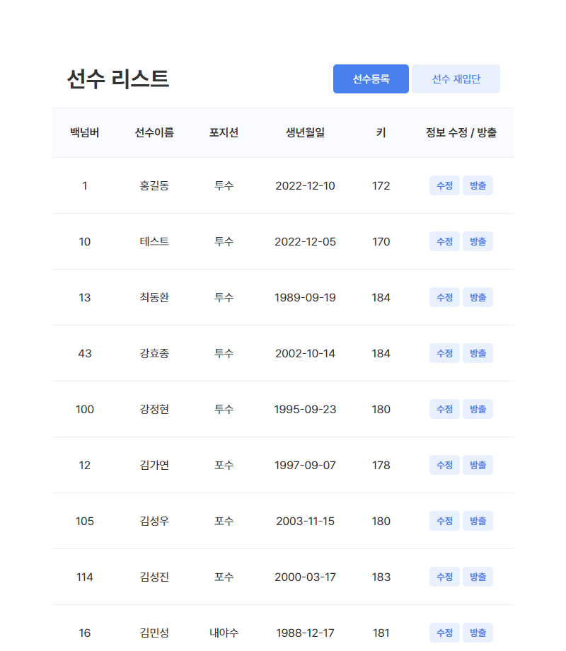
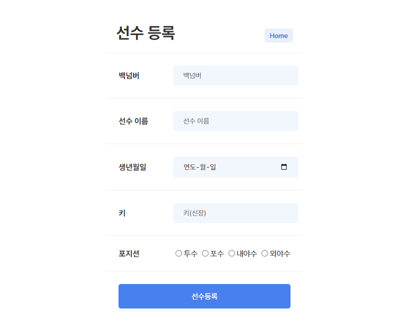
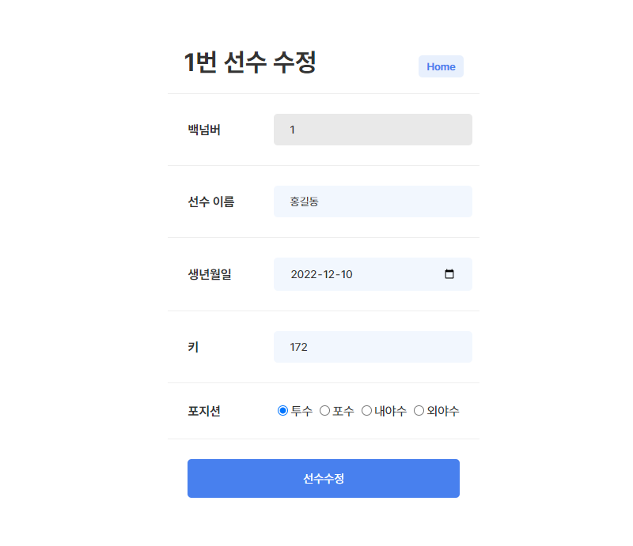
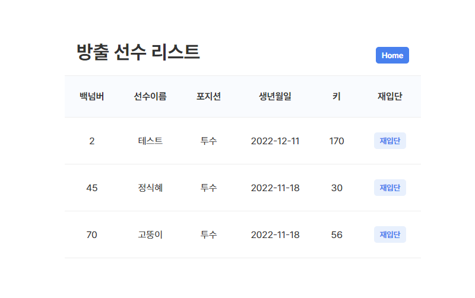

# [⭐Mini Project] - Sevlet / BaseballPlayer

- ✍🏻 **Recorded Date** : 2022년 12월 11일 오후 8:09
- 💬 **Comment** : 서블릿을 배우고 드디어! 웹사이트 다운 웹사이트를 제작할 수 있게 되었다! 너무너무 신나는 걸😉 지난번 실습 과제로 진행했던 야구선수 자바 프로그램을 이용해서 웹 사이트를 제작하는 과제였다! DAO와 DTO는 기존 만들었던 대로 사용했고, 서블릿을 추가해 DB와 연동 + 웹 사이트 제작까지 해보았다!
- [**2차 : Sevlet - BaseballPlayer 웹 사이트 코드**](https://github.com/6suk/JavaWebLecture/tree/master/src/main/java/baseballPlayer)
- [1차 : JDBC - BaseballPlayer 자바 앱 코드](https://github.com/6suk/JavaLecture/tree/master/src/mysql/baseballPlayer)
- [노션에서 보기](https://www.notion.so/Mini-Project-Sevlet-BaseballPlayer-f6d714fa630d473e853af7f6f56bc0b4)

<br><br>

### ◽ 과제 내용

1. 좋아하는 프로야구 구단의 선수를 등록하려고 한다.
2. 등록하려는 정보는 선수명, 백넘버, 포지션, 생년월일, 키(height)
3. primary key는 백넘버로 한다.
4. 각 포지션(투수, 포수, 내야수, 외야수) 별로 3명 이상의 선수를 등록한다.
5. **선수 목록**, **선수 등록**, **선수정보 수정**, **선수 방출**할 수 있는 App 만들기
6. +) 여기서 나는 **선수 재입단**도 추가해보았다!

<br><br>

## 🔸 사이트 구조

| no  | Next Page | name          | routing                 | method     | input                                      |
| --- | --------- | ------------- | ----------------------- | ---------- | ------------------------------------------ |
| 1   |           | 선수목록      | /ch07/playerList        | GET        | num, name, position, bDay, Height          |
| 2   | 3         | 선수등록 PAGE | /ch07_02/regPlayer.html | -          |                                            |
| 3   | 1         | 선수등록      | /ch07/regPlayer         | POST       | num, name, position, bDay, Height          |
| 4   | 1         | 선수방출      | /ch07/deletePlayer      | GET        | num                                        |
| 5   | 1         | 선수수정      | /ch07/updatePlayer      | GET + POST | num<br>option name, position, bDay, Height |
| 8   | 1         | 선수재입단    | /ch07/rejoinPlayer      | GET + POST | num                                        |

<br><br>

## 🔸 선수 목록 - HOME

- **선수 리스트 출력**
  - DB에 저장된 야구 선수 리스트는 GET 방식으로 출력한다.
  - 기존에 DAO에 제작해둔 `playerList()` 메소드를 활용 HTML로 출력한다.
- **선수 재입단, 선수 수정, 방출**
  - 버튼을 누르면 각 매핑된 루트로 이동한다.
  - **방출 :** GET 방식으로 받아 `delete()` 메소드에 선수 백넘버를 넘겨 처리한다.
    - DB에는 `isDelete` 라는 항목 `0`, `1`로 선수의 등록 여부를 나눴다.
    - 때문에 이때 `delete()` 메소드로 전송되는 SQL문은 `DELETE`가 아닌 `UPDATE`이다.


<br><br>

## 🔸 2. 선수 등록



<br>

### ◽ 선수 등록 - 유효성 검사

- **HTML**
  - DB **모든 값** == `NOTNULL`
    - input required 속성 추가
  - DB **name** type == `varchar(4)`
    - input maxlength 4 로 제한

```html
<input type="number" name="bNum" placeholder="백넘버" required />
<input type="text" name="name" placeholder="선수 이름" maxlength="4" required />
<input type="date" name="bDay" placeholder="생년월일" required />
<input type="number" name="h" placeholder="키(신장)" max="250" required />
```

- **Servlet**
  - 백넘버 == `Primary Key` : 중복값이 들어오지 않도록 Servlet에 유효성 검사 추가

```java
/** 유효성 검사 */
if(dao.getPlayer(bNum).getNum() != 0) {
	response.sendRedirect("/ch07_02/regPlayer.html");
}else {
	name = request.getParameter("name");
	posi = request.getParameter("posi");
	bDay = request.getParameter("bDay");
	h = Integer.parseInt(request.getParameter("h"));
	p = new Player(bNum, name, posi, bDay, h);
	dao.setPlayer(p);
	response.sendRedirect("/ch07/playerList");
}
```

<br><br>

## 🔸 3. 선수 수정

- **Get 방식**으로 해당 선수 수정 페이지로 이동한다.
  - `/ch07/updatePlayer?bNum=xxx`
- `key`값인 백넘버를 제외한 **나머지 속성들은 수정 가능**하다.
- 첫 화면은 **기존 정보가 input value에 기입**되어 있다.
- ‘선수 수정’ 버튼을 누르면 새로 기입된(또는 기존 정보) `value`를 **Post 형식**으로 받는다.
- DAO에 `update()` 메소드로 **sql문을 전송**한다.
- 수정이 적용된 **홈 화면 (선수 리스트)으로 이동**한다.



<br><br>

## 🔸 4. 선수 재입단

- **GET**
  - 홈 화면에서 **선수 재입단** 버튼을 누르면 가장 먼저 ‘**방출 선수 리스트**’가 출력된다.
  - 각 리스트 별로 input hidden 속성을 추가해 value는 선수의 백넘버로 했다.
  - ‘재입단’ 버튼의 속성을 submit으로 주고, **해당 선수의 백넘버를 Post방식**으로 보낸다.
- **POST**
  - 전달받은 선수의 백넘버를 인자로 받아 DAO `재입단 메소드`를 실행시킨다.
  - 이때 전송되는 SQL문은 기존 isDelete의 값을 `1`에서 `0`으로 `UPDATE`한다.
  - 재입단이 적용된 **홈 화면 (선수 리스트)으로 이동**한다.



<br><br><br><br>
