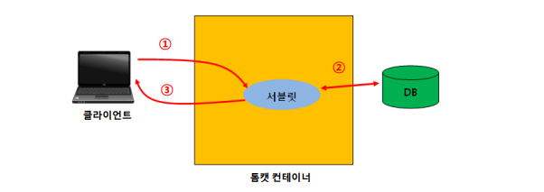
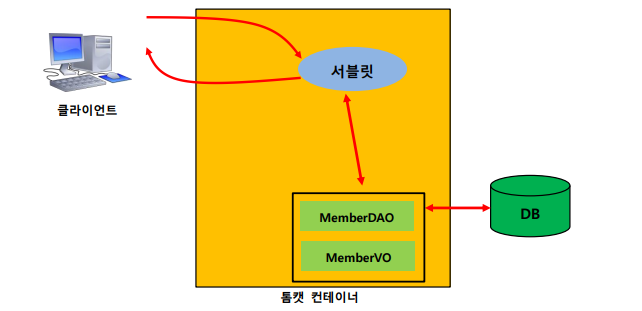
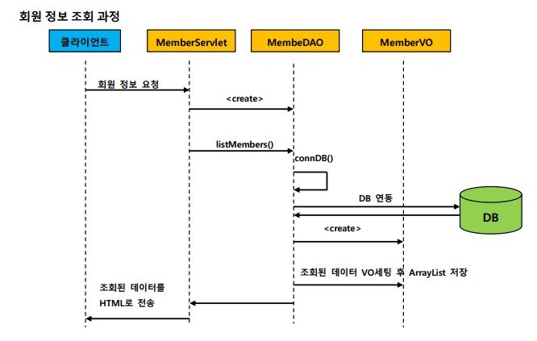

# 4. Servlet - 비즈니스 처리

 
 

- ✍🏻 **Recorded Date** : 2022년 12월 9일
- 🔖 **Notion** : [노션에서 보기](https://www.notion.so/6suk/4-Servlet-c218af9afe6a41c7a0bf34cc93bfd279?pvs=4)

 
 

## 🔸 서블릿 비즈니스 처리 작업

- 서블릿이 클라이언트로부터 요청을 받으면 그 요청에 대해 작업을 수행하는 것
- 웹 프로그램에서 대부분의 비즈니스 처리 작업은 데이터베이스 연동 관련 작업이지만 그 외에 다른 서버와 연동해서 데이터를 얻는 작업도 수행
- 서블릿의 가장 핵심 기능

 

### ◽ 서블릿의 비즈니스 처리 작업 예

- 웹 사이트 **회원 등록** 요청 처리 작업
- 웹 사이트 **로그인 요청** 처리 작업
- 쇼핑몰 **상품 주문** 처리 작업

 

### ◽ 서블릿의 비즈니스 처리 과정

 

 

1. 클라이언트로 부터 요청
2. 데이터베이스 연동과 같은 비즈니스 로직 처리
3. 처리 결과를 클라이언트에게 전송

 

### ◽ 서블릿으로 회원 정보 조회 과정

 

1. 회원 정보 요청
2. 서블릿은 MemberDAO 객체를 생성하여 `listMembers()` 메서드 호출
3. `listMembers()` → `ConnDB()` 메서드를 호출하여 데이터베이스와 연결 → SQL문 실행 → 회원 정보 조회
4. 조회된 회원 정보는 `MemberVO` 속성에 설정한 후 ArrayList에 저장
5. ArrayList를 다시 메서드를 호출한 `MemberServlet`으로 반환 → ArrayList의 `MemberVO`를 차례대로 가져와 회원 정보를 HTML 태그의 문자열로 출력
6. 만들어진 HTML 태그를 웹 브라우저로 전송 → 회원 정보 출력

    