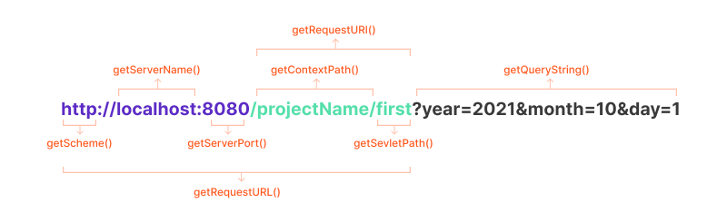

# 2. Servlet - 요청·응답 API / Form 속성

> `HttpServletRequest` / `HttpServletResponse` / `getParameter()` / `setContentType()`

<br>
<br>

- ✍🏻 **Recorded Date** : 2022년 12월 8일
- 🔖 **Notion** : [노션에서 보기](https://www.notion.so/6suk/2-Servlet-API-Form-b9801f1535fe41cd94ac59975d029585?pvs=4)

<br>
<br>

## 🔸 서블릿 요청과 응답 API

- **요청 API** : javax.servlet.http.HttpServlet**Request** 클래스
- **응답API** : javax.servlet.http.HttpServlet**Response** 클래스

```java
protected void doGet(HttpServletRequest request, HttpServletResponse response)
	throws ServletException, IOException {
		...
}

protected void doPost(HttpServletRequest request, HttpServletResponse response)
	throws ServletException, IOException {
		...
}
```

<br><br>

## 🔸 요청 API - HttpServletRequest 메서드

<br>

### ◽ QueryString 이란?

- 주소창에 정보를 요청할 때(get) 물음표 뒤에 오는 추가 데이터
- 쿼리스트링은 말 그대로 String 이기 때문에 값을 받을 때 String 타입으로 받아줘야한다.
- 쿼리스트링은 name, value 한 쌍으로 이루어져 있다
  - `year` : name / `2021` : value

<br><br>

## 🔸 HTML - form 태그의 속성

- HTML에서 `<form>` 태그로 서블릿에 요청
- `submit` 클릭 시 input 태그의 name **속성의 값**과 **실제 입력한 데이터 전송**

```html
<form name="login" method="post" action="/ch06/login" enctype="UTF-8">
  <input type="text" name="uid" />
  <input type="text" name="pwd" />
  <input type="submit" name="uid" value="로그인" />
</form>
```

- `name`
  - 태그의 이름 지정, 여러 개의 form이 존재할 경우 구분하는 역할
  - 자바스크립트에서 form 태그에 접근할 때 자주 사용
- `method`
  - 데이터 전송 방법 지정 ( get / post ) , 아무것도 지정하지 않을 경우 get이 기본값
- `action`
  - form 태그에서 데이터를 전송할 서블릿이나 JSP 지정
  - 서블릿 전송 : 매핑 이름 사용
- `encType`
  - 전송할 데이터의 encoding타입 지정
  - 파일 업로드 : multipart/form-data로 지정

<br><br>

## 🔸 요청 API - HttpServletRequest 메서드

- 전송된 데이터를 받아오는 메서드

| 타입     | 메소드명                        | 내용                                                                                                                                                   |
| -------- | ------------------------------- | ------------------------------------------------------------------------------------------------------------------------------------------------------ |
| String   | getParameter(String name)       | Client가 보내준 값이 매개변수과 같은 명칭에 저장된 값을 불러오는 메소드                                                                                |
|          | getParameterNames()             | Client가 보내준 값을 저장한 명칭(Key)을 불러오는 메소드<br>name 값을 모를 때 사용                                                                      |
| String[] | getParameterValues(String name) | Client가 보내준 값이 여러개일 경우 그 값을 배열로 불러오는 메소드(Key 제외)                                                                            |
| Map      | getParameterMap()               | Client가 보내준 값의 전체를 Map 방식으로 불러오는 메소드                                                                                               |
| Object   | setAttribute(String,object)     | request객체에 전달하고 싶은 값을 Strting 이름으로 Object 타입으로 저장하는 메소드<br>ex) req.setAttiribute(”객체명”, 객체) → Key와 Value 형식으로 전달 |
| Object   | getAttribute(String)            | 매개변수와 동일한 객체 속성값을 불러오는 메소드                                                                                                        |
|          | removeAttibute(String)          | request 객체에 저장되어 매개변수와 동일한 속성값을 삭제하는 메소드                                                                                     |
|          | setCharacterEncoding(String)    | 전송받은 reques객체의 값들의 CharaterSet을 설정해주는 메소드<br>ex) request.setCharacterEncoding("UTF-8");                                             |
|          | getRequestDispatcher(String)    | 컨데이너내에서 request, response객체를 전송하여 처리할 컨포넌트(jsp 파일 등)를 불러오는 메소드로 forward()메소드와 같이 사용                           |

<br>

### ◽ 요청API - 예시코드

```html
<form action="/ch06/register" method="post">
  <input type="text" name="uid" placeholder="ID" maxlength="10" minlength="1" required />
  <input type="password" name="pwd" placeholder="Password" required />
  <input type="checkbox" name="hobby" value="놀기" />놀기 <input type="checkbox" name="hobby" value="코딩" />코딩
  <input type="submit" value="회원가입" />
</form>
```

```java
request.setCharacterEncoding("utf-8");
String uid = request.getParameter("uid");
String pwd = request.getParameter("pwd");
String[] hobby = request.getParameterValues("hobby");
```

<br><br>

## 🔸 응답처리 - HttpServletResponse

- `doGet()`이나 `doPost()` 메서드 안에서 처리
- javax.servlet.http.HttpServletResponse 객체 이용
- `setContentType()` 을 이용해 클라이언트에게 전송할 데이터 종류(MIME-TYPE)를 지정함
- 클라이언트(웹 브라우저)와 서블릿의 통신은 자바 I/O의 스트림 이용

<br>

### ◽ MINE-TYPE

- 톰캣 컨테이너에 미리 지정해 놓은 데이터 종류
- 서블릿에서 브라우저로 전송 시 설정해서 사용
- **HTML** : text/html
- **일반 텍스트** : text/plain
- **XML 데이터** : application/xm
- 더 다양한 타입은 `Tomcat` → `web.xml` → `<extension>` 에서 확인 가능

<br>

### ◽ 응답 처리 순서

1. `setContentType()` 이용, MIME-TYPE 지정
2. 데이터 출력할 `PrintWriter` 객체 생성
3. 출력 데이터를 HTML 형식으로 제작
4. `PrintWriter`의 `print()` `println()`을 이용해 데이터 출력

<br>

### ◽ 예시코드

```java
response.setContentType("text/html; charset=UTF-8"); // 1번
PrintWriter out = response.getWriter(); // 2번
out.print(...); // 4번
```

<br><br><br><br>
