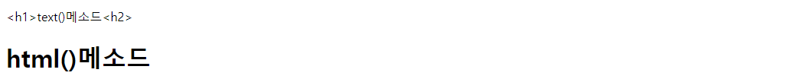

# 9. JS - JQuery
<br>

- ✍🏻 **Recorded Date** : 2022년 12월 5일 오후 1:41
- 💬 **Comment** : 요즘 서블릿을 배우면서 계속 무언가를 만들고 추가해 보느라고 TIL 올릴 시간이 없었다.. 며칠 못 올리면서 노선에 올릴 TIL이 엄청나게 쌓였다는거..ㅎㅎ.. 지난 거 복습도 이렇게나마 꼭꼭 다시 해보기!🐣
- 🔖 **Notion** : [노션에서 보기](https://www.notion.so/9-JS-JQuery-f0a84bb289804854b8227c03cba76464)

<br>
<br>

## 🔸  jQuery 객체

- `$(document).ready()`

```jsx
$(document).ready(function () {
	...
	});

window.onload = function(){};
// window.onload와 같은 의미
```

<br><br>

## 🔸 문서 객체 조작

### ◽ 문서 객체 선택 및 조작

| 메소드 | 설명 |
| --- | --- |
| parent() | 부모 태그 선택 |
| find() | 후손 태그 선택 |
| length() | 선택된 문서의 객체의 수 |
| get() | 선택한 문서 객체 중 하나 선택 |
| each() | 선택한 문서 객체에 반복 적용 |

<br>

- css 선택자를 사용해 문서 객체를 선택
```jsx
$('h1') // h1 태그 선택
$('h1.logo') // h1 태그 중 logo class 선택
$('#head') // id 속성이 head인 태그 선택
$('input[type=submit]') // input 태그 중 type 속서이 submit인 태그 선택
$('#fruits .national').css('backgroundColor', 'coral');
```

- length() , get()
```jsx
const h1 = $('h1');
  for (let i = 0; i < h1.length; i++) {
    if (i % 2 == 1) {
      const h1Ele = h1.get(i);
      $(h1Ele).css('backgroundColor', 'yellow');
    }
  }
```

- each()
```jsx
// 위 코드와 동일한 결과

h1.each(function (index, element) {
  if (index % 2 == 1) {
    $(this).css('backgroundColor', 'yellow');
}
```

<br><br>

### ◽ 글자 조작

| 메소드 | 설명 |
| --- | --- |
| text() | html 태그 내부의 문자 조작<br>모든 문서 객체 내부의 문자 출력 |
| html() | html 태그 내부의 문자 조작 (HTML 태그 인식)<br>첫번째 문서 객체 내부의 문자 출력 |
<br>

- 예시코드

```html
<p class="text-1">TextA</p>
<p class="text-2">TextB</p>
```

```jsx
/* text(), html() */
$('.text-1').text('<h1>text()메소드<h2>');
$('.text-2').html('<h1>html()메소드<h2>');
```

<br>

- 출력


<br><br>

### ◽ 스타일 조작

- `css()` : 스타일 조작

```java
$('태그선택').css('스타일속성', '값') // 스타일 속성을 값으로 설정

$('h1').css('color') // color 속성 가져오기
$('h1').css('color', 'red') // color를 red로 설정

$('h1').css({
	color : 'red',
	backgroundColor : 'coral'
}) // 한꺼번에 설정 가능
```

<br>

### ◽ 속성 조작

- `attr()`

```java
$('img').attr('src') // img 태그의 src 속성 가져오기
$('img').attr('src', ',/img/img.png') // img 태그의 src 속성 tjfwjd
$('img').attr({
	src : './img/img.png',
	alt : 'placehold'
})
```

<br>

### ◽ 문서 객체 추가

| 메소드 | 설명 |
| --- | --- |
| $(A).prependTo(B) | A를 B 안쪽 앞에 추가 |
| $(A).appendTo(B) | A를 B 안쪽 뒤에 추가 |
| $(A).insertBefore(B) | A를 B 앞에 추가 |
| $(A).insertAfter(B) | A를 B 뒤 에 추가 |

<br>

### ◽ 이벤트

- `$(선택자).on(이벤트이름, 콜백함수)`

| 메소드 | 설명 |
| --- | --- |
| on() | 이벤트 연결 |
| off() | 이벤트 제거 |
| one() | 이벤트를 한 번만 연결 |

<br>

- 키보드 이벤트

| 메소드 | 설명 |
| --- | --- |
| keydown() | 키보드 키를 눌렀을 때 |
| keypress() | 키가 입력되었을 때 |
| keyup() | 키보드 키를 떼었을 때 |

<br>

- 마우스 이벤트

| 메소드 | 설명 |
| --- | --- |
| click() | 마우스 클릭 |
| dbclick() | 더블클릭 |
| mousedown() | 마우스 버튼을 눌렀을 때 |
| mouseenter() | 마우스 커서가 해당 태그로 들어갔을 때 |
| mouseleave() | 마우스 커서가 해당 태그로 나갔을 때 |
| mousemove() | 마우스가 움질일 때 |
| mouseup() | 마우스 버튼을 뗄 때 |

<br>

- 입력 양식 / 웹 브라우저 이벤트

| 메소드 | 설명 |
| --- | --- |
| blur() | 입력 양식에 값 입력을 종료할 때 |
| change() | 입력 양식의 값이 변경될 때 |
| focus() | 입력 양식에 값 입력을 시작할 때 |
| select() | select 속성인 입력 양식의 목록에서 값을 선택했을 때 |
| submit() | submit 속성인 입력 양식을 클릭했을 때 |
| resize() | 웹 브라우저의 크기를 변경할 때 |
| scroll() | 웹 브라우저를 스크롤할 때 |

<br><br>

### ◽ 이벤트 간접 연결

```java
$('부모객체').on('click','이벤트 연결될 객체',function(){});

let cntThree = 1;
/* 이벤트 간접 연결 */
$('<button></button>').text(`이벤트 간접 연결`).appendTo('body');

$('body').on('click', 'button', function () {
  $('<p></p>').text(`버튼클릭 ${cntThree}`).appendTo('body');
  cntThree++;
});
```

<br><br><br><br>