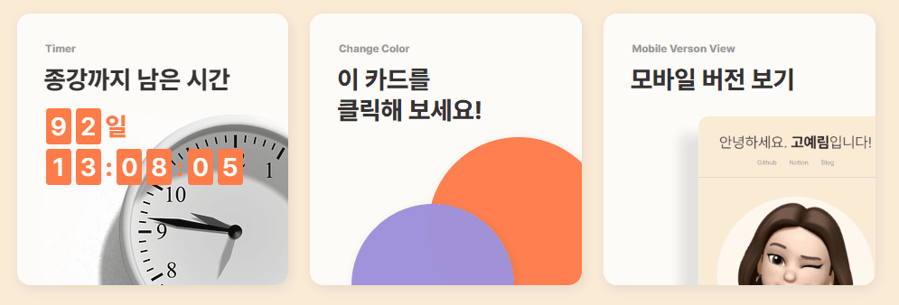
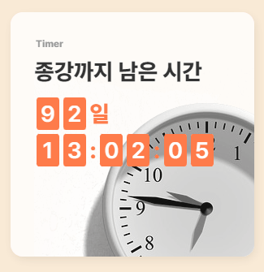
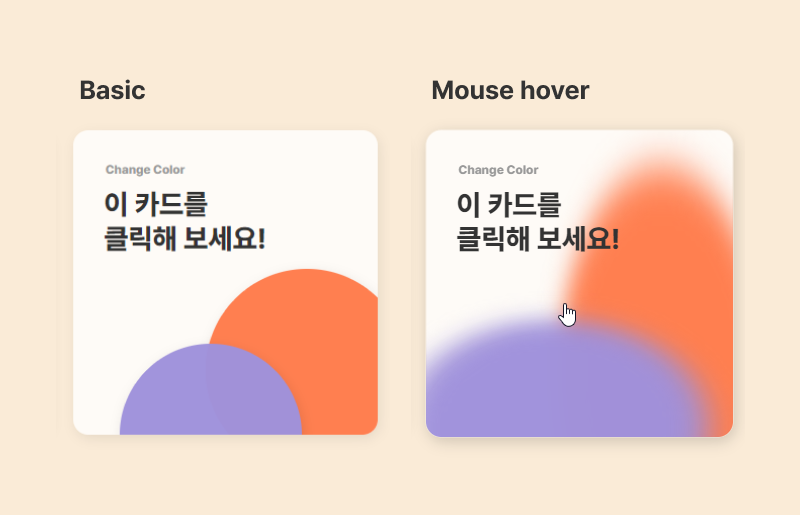
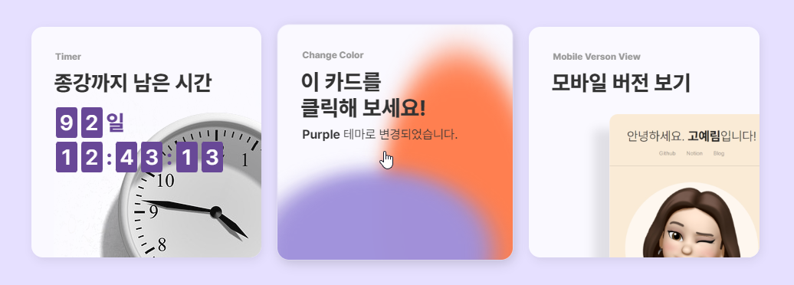
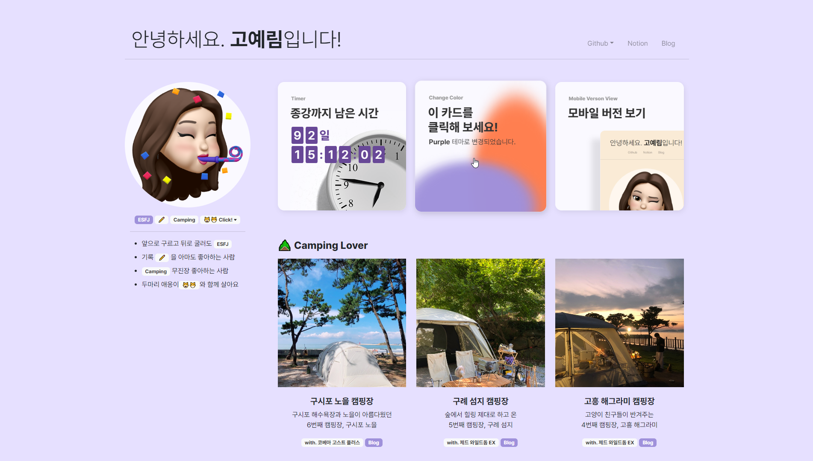
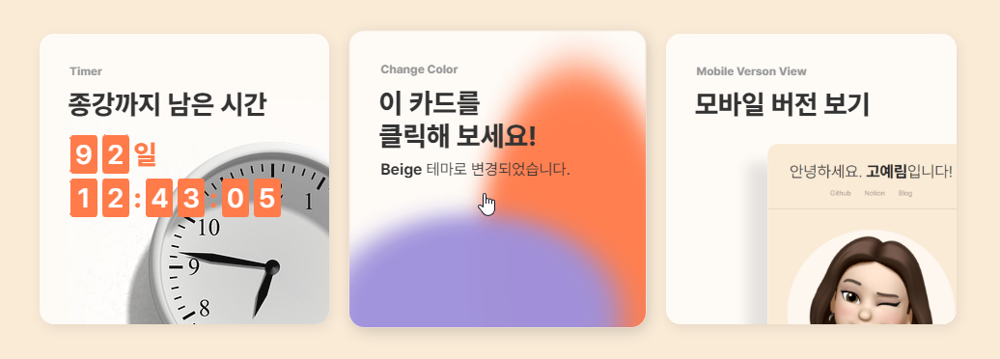
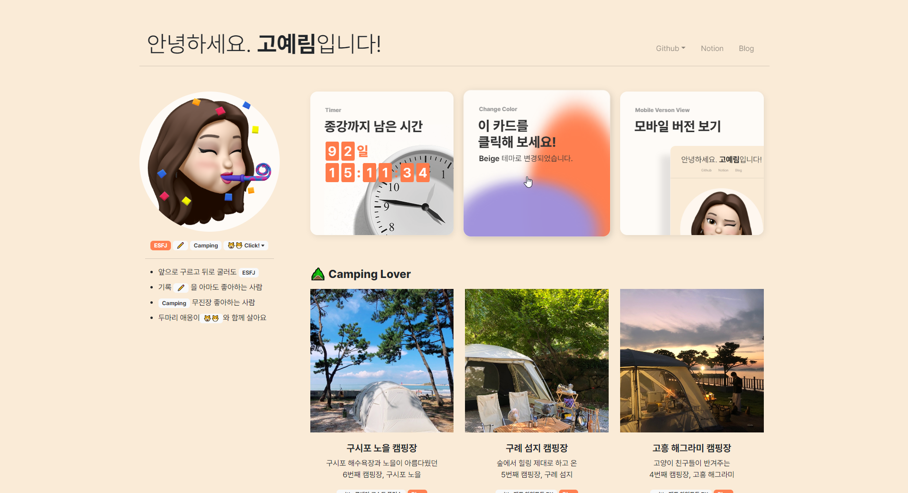
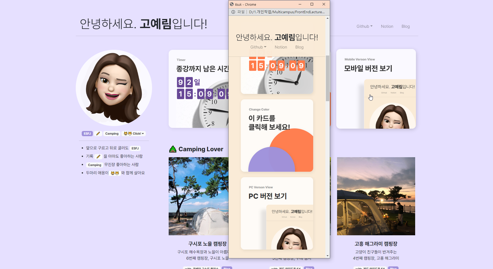

# [⭐Mini Project] 첫 웹페이지에 js 적용하기
<br>

- ✍🏻 **Recorded Date** : 2022년 12월 05일 오후 7:30
- 주말동안 기존 제작했던 웹페이지에 한 주간 배운 `JavaScript`를 적용했다!<br>사실 적용하는 것보다 **어떤 기능을 넣을지 고민하는 시간이 더 길었다<br> 11월 26일 첫 과제를 받고 `ver01` 부터 시작해서 → `ver02` → 자바 스크립트를 적용한 현재 버전 `ver3` 요렇게 3단계에 기능이 추가되다 보니 코드가 너무 복잡해져 내가 작성한 코드를 다 갈아엎어버리고 싶다😢<br>
하지만, 내 마음대로 정리하는 것보단 **다른 곳들은 어떻게** ‘보기 쉽게’ 코드 **작성하는지**를 알아보는 게 우선인 것 같아 일단 추가된 `JavaScript` 기능들만 먼저 기록 하려 한다!<br>
꼭 잊지 말고, 어떻게 하면 더 코드가 보기 좋을지 고민해 보기!
- [첫 웹페이지 ver1, ver2 코드 보러가기](https://github.com/6suk/FrontEndLecture/tree/master/00.MiniProject)
- [JavaScript 추가한 ver3 코드 보러가기](https://github.com/6suk/FrontEndLecture/tree/master/00.MiniProject_JavaScript)
- [노션에서 보기](https://www.notion.so/Mini-Project-js-1e0c62a40b0f42019e21f09c23ffe929)

<br><br>

<br>

## 🔸 추가된 기능

1. **프로필 이미지 슬라이드**
2. **종강 타이머**
    - 종강까지 남은 시간
    - 시계 이미지 자동 슬라이드
3. **테마 변경 버튼** - 2번 카드 클릭 시 홈페이지 컬러 변경
4. **모바일 버전 보기** - 3번 카드 클릭 시 모바일 사이즈 브라우저 오픈

<br><br>

## 🔸 1. 프로필 이미지 슬라이드

- 프로필 이미지가 돌아가며 노출 되도록 구현<br>


<br><br>

## 🔸 2. 종강 타이머

- 종강까지 남은 시간 타이머 구현
- 배경에 돌아가는 시계 이미지 구현<br>

<br>

<br>

### ◽ JavaScript 구현 코드

- 두가지 기능 모두 `window.onload` 속성을 통해 **웹사이트가 열리는 순간** 바로 구현되도록 했다.
- ‘일정한 시간’에 맞춰 변경이 필요하기 때문에 `setInterval()` 함수를 이용해 Timer 기능에는 시간을 넘겨주고, 인트로 이미지엔 미리 작성해둔 `#showimg` `#hideimg` 로 번갈아 아이디를 바꾸도록 구현했다.
- 타이머는 `00일 00 : 00 : 00` 시간 박스는 부모 `div`의 `display` 속성에 `flex`를 주어 일정하게 배치했다.
각각 자식 `div`에게 처음엔 `padding`으로 속성값을 줬었는데, 숫자의 폭이 달라 박스가 너무 들쑥날쑥했다.
이 문제는 각각 `div`로 감싸고 강제로 `width`값을 주어 해결했다.

```jsx
window.onload = function () {
  // timer
  setInterval(() => moveClock(), 1500);
  setInterval(() => {
    const TIMERTEXT = document.querySelectorAll('.timer');
    let DATE = EndCourseTime();
    for (let i = 0; i < TIMERTEXT.length; i++) {
      TIMERTEXT[i].innerHTML = DATE[i];
    }
  }, 1000);

  // 인트로 이미지
  setInterval(() => {
    const hideimg = document.querySelector('#hideimg');
    const showimg = document.querySelector('#showimg');
    hideimg.id = 'showimg';
    showimg.id = 'hideimg';
  }, 2000);
};
```

<br><br>

## 🔸 3. 테마 변경 버튼

- **Mouse hover** - 전 / 후
    
 <br><br>
    

- **Click** - 보라색 테마
    
    ‘**Purple** 테마로 변경되었습니다.’
    



<br><br>

- **Click** - 베이지 테마
    
    ‘beige 테마로 변경되었습니다.’
    



<br><br>

### ◽ JavaScript 구현 코드

- **body**를 포함한 **뱃지**, **버튼**, 종강 타이머의 **시간 박스**에게 `#beige` 아이디를 추가했다.
- 자바 스크립트를 통해 버튼 클릭 시 `#beige` 를 `#purple`로 변경하도록 했다.
- `fade in, out` 효과가 있었으면 해서 `display : none;`으로 하지 않고, `opacity`를 `0`으로 줄이는 방법을 택했다. 근데 찾아보면 더 좋은 방법이 있을거 같다!🤣

```jsx
/*  버튼 클릭 시 배경화면 컬러 변경 구현 */
function changeBg() {
  let body = document.body;
  if (body.id == 'beige') {
    let bg = document.querySelectorAll('#beige');
    for (let a of bg) {
      a.setAttribute('id', 'purple');
      a.style = `transition: all 0.8s;`;
      cardtxt[0].style = `opacity: 1; transition: opacity 0.4s cubic-bezier(0, 0, 0.5, 1);`;
      cardtxt[1].style = `opacity: 0; transition: opacity 0.4s cubic-bezier(0, 0, 0.5, 1);`;
    }
  } else {
    let pp = document.querySelectorAll('#purple');
    for (let a of pp) {
      a.setAttribute('id', 'beige');
      a.style = `transition: all 0.8s;`;
      cardtxt[0].style = `opacity: 0; transition: opacity 0.4s cubic-bezier(0, 0, 0.5, 1);`;
      cardtxt[1].style = `opacity: 1; transition: opacity 0.4s cubic-bezier(0, 0, 0.5, 1);`;
    }
  }
}
```

<br><br>

## 🔸 4. 모바일 버전 보기

- 클릭 시 **모바일 크기** 브라우저 오픈
- **모바일 버전일 땐** ‘PC 버전 보기’ 로 텍스트 변경 → 클릭 시 PC버전 브라우저 크기로 오픈

<br><br>

### ◽ JavaScript 구현 코드

- 요 코드가 어쩔 땐 제대로 먹히고 어쩔땐 안먹혀서.. 아주 내 속을 썩인다.. (아직도ㅋㅋㅋ)
콘솔로 `window.innerWidth` 를 확인 했을 땐 제대로 반응 하는데 함수가 문제인건가..😢
- 그래도 다행인건 안될 땐 새로고침을 하면 제대로 구동은 된다..는거..
- 열심히 구글링 해봤지만 해결이 되지 않아 뺄지 말지 고민했던 기능 일단 더 이것저것 건드려보는 걸루..

```jsx
window.onresize = function (event) {
  let screenW = window.innerWidth;
  const mViewtxt = document.querySelectorAll('#mview');
  // pc,m 버전
  if (screenW <= 768) {
    mViewtxt[0].innerHTML = `PC Verson View`;
    mViewtxt[1].innerHTML = `PC 버전 보기`;
    document.querySelector('#card03').setAttribute('onclick', 'mWindow(1920)');
  } else {
    mViewtxt[0].innerHTML = `Mobile Verson View`;
    mViewtxt[1].innerHTML = `모바일 버전 보기`;
    document.querySelector('#card03').setAttribute('onclick', 'mWindow(390)');
  }
};

function mWindow(width) {
  window.open(`${location.pathname}`, '_blank', `width=${width}, height=844`);
}
```

<br><br><br><br>