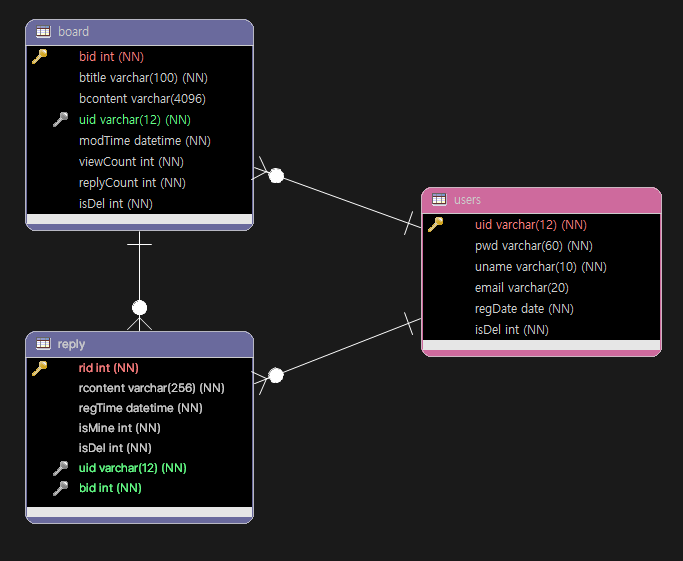

# 5. SQL - 관계형 데이터 베이스 / 다이어그램 / BCrypt
>  Foreign Key / ERMater / `BCrypt.hashpw()` `.gensalt()` / `Checkpw()`

<br>
<br>

- ✍🏻 **Recorded Date** : 2022년 11월 21일 오후 1:03
- 💬 **Comment** : 오늘 md파일 액션이 최신글 노출 제대로 작동하지 않는 문제 때문에 시간을 다 날렸다..😢<br>해결이 안돼서 찝찝하지만 시간 두고 좀 더 찾아보는걸루..ㅠㅠ
- 🔖 **Notion** : [노션에서 보기](https://6suk.notion.site/5-SQL-BCrypt-fa9c89c86dac46a1a33cf767bd9cfdc9)

<br>
<br>

## 🔸 1. 관계형 데이터 베이스(**relational database)**

- 일대일관계(one to one)
- 일대다관계(one to many)
- 다대다관계(many to many)

<br>

### ◽ 아토믹 (atomic)

- 관계 데이터베이스에서 독립 요소로 더 이상 분해될 수 없는 속성. ⇒규범 표기는 미확정이다.

<br>

### ◽ 외래키(Foreign Key)

- 관계형 데이터베이스에서 하나의 테이블 속성, 속성 집합이 다른 테이블의 기본키가 되는 것
- 기본키는 유일해야만 하고, 중복되는 값 또는 비어있는 값이 없어야 한다.
- 반면 외래키는 중복되는 값을 가질 수 있으며 비어있는 값 또한 가질 수 있다.

<br>

### ◽ 외래키(Foreign Key) 제약조건 해제 / 설정

```java
SET FOREIGN_key_checks = 0; # 체크 해제
SET FOREIGN_key_checks = 1; # 체크 설정
```

<br><br>

## 🔸 2. 다이어그램

| 사용환경 | 이름 |
| --- | --- |
| 웹사이트 | draw.io |
| 이클립스 | ERMater |

<br>

### ◽ ERMater

- 생성하기
    - new > other > ERMater > 데이터베이스 : MySQL
    - Table 생성 > Field 값 입력
    - 외래키 설정은 1:N 관계 선택 > 부모Table에서 자식 Table 드래그
- ERM 내보내기
    - 우클릭 > 내보내기 > DDL
    - 변환된 SQL문 저장 > MySQL에서 불러오기
- DAO 생성하기
    - 우클릭 > 내보내기 > Java

<br><br>

## 🔸 3. 게시판 만들기

### ◽ 3-1. Table 만들기

<br>

### ◽ 3-2. ERM 만들기


<br>

### ◽ Users / board / reply DAO, DPO 만들기

<br><br>

## 🔸 4. BCrypt

- [Bcrypt jar 다운로드](http://www.java2s.com/example/jar/j/download-jbcrypt04jar-file.html)

### ◽ Password 암호화하기

- 평문 → 암호화
- `BCrypt.hashpw()` : 암호화하는 메소드
- `.gensalt()` : 의미없는 글자를 첨가한다.

```java
String pwd = "456789adbd";
String cryptedPwd = BCrypt.hashpw(pwd, BCrypt.gensalt());
System.out.println(cryptedPwd.length());  // 60
System.out.println(cryptedPwd);
//$2a$10$KMaAAVRNPNF0zr097JqA8OzTDDRAtDNm7JI4OFPmmOQK3QkOXUq72

//$2a : BCrypt version 정보
//$10 : 라운드 정보
```

<br>

### ◽ 암호화된 패스워드 동일 검사

- `Checkpw()`

```java
/** 3. 패스워드가 동일한지 확인 */
boolean result = BCrypt.checkpw(pwd, cryptedPwd);
System.out.println(result);  // 'true' 출력
```

<br><br>

### ◽ Library 설치

- mysql… .jar
    - 다운로드 받아서 설치
    - 버전 관리가 어렵다
- Java EE perspective - pom.xml
    - 특정한 파일에 설치할 파일 코드만 적으면 됨