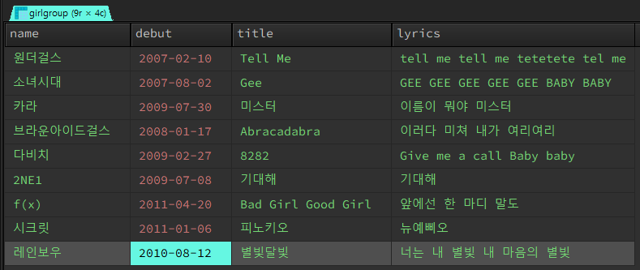
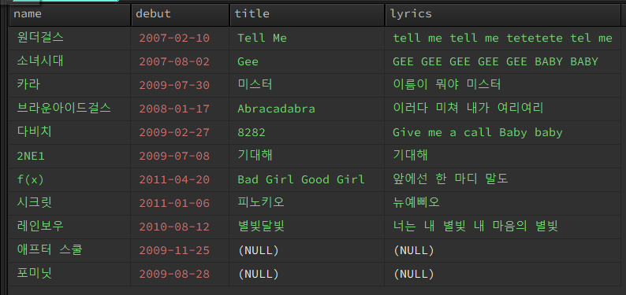
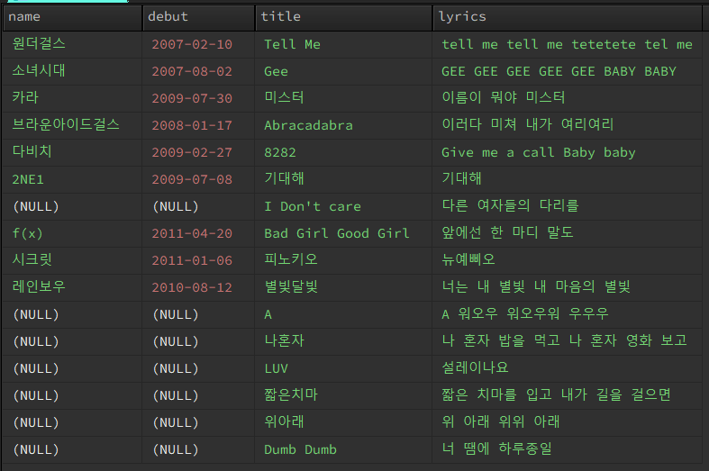
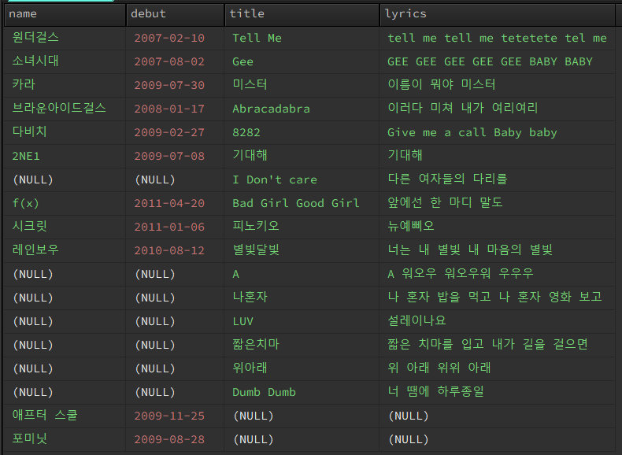

# 3. SQL - JOIN
>  Inner Join / Left Join / Right Join / Full Outer Join

<br>
<br>

- ✍🏻 **Recorded Date** : 2022년 11월 17일 오후 4:25
- 💬 **Comment** : 오늘 JS를 배우면서 혼란이 오기 시작했다.<br>자바 배우고 SQL / HTML / CSS를 배웠을 땐 언어가 확연히 달라 오히려 쉬웠다.<br>자바스크립트와 자바의 문법은 아직 나로선 너무 비슷하게 느껴져 자꾸 헷갈린다😢<br>지금까지 늘 그날 배운 것은 최대한 많은 자료를 참고하고 '이해'하려 노력했다.<br>근데 오히려 너무 이해하려 드니까 어려운 거 같기도 하고..😢<br>이제 무작정 외워야 하는 순간이 온 걸까…?는 내 성격상 그렇겐 못함😋<br>아몰랑.. 무튼 강의 끝나고 멘붕에 빠져 있는데 문자가 왔다. 기프티콘과 함께<br>내가 1분기 우수훈련생이란다! 일단 기뻐하기🎉🎉<br>정신 차리라는 하늘의 뜻인가 보다🤣 감사합니다아ㅏㅏㅏ<br>기분 좋으니까, 이것도 냅다 박제 해놓기! 오늘의 고민도 언젠간 지나갈거야...!😌<br>


- 🔖 **Notion** : [노션에서 보기](https://www.notion.so/3-SQL-JOIN-4fe4e9091c7848d79e4dcf0900c25196)

<br>
<br>


## 🔸 1. JOIN

- 두 개의 테이블을 서로 묶어서 하나의 결과를 만들어내는 것

```sql
SELECT <열 목록>
FROM <첫 번째 테이블>
        JOIN <두 번째 테이블>
        ON <조인될 조건>
[WHERE 검색 조건]
```
<br>

### ◽ JOIN / ON

- `ON` / `WHERE` : 조건절로 쓰인다.
    - `ON` - **JOIN이 실행되기 전 (조인이 될 조건)**
    - `WHERE` - **JOIN이 실행된 후**

```sql
# 도시의 갯수가 많은 나라 Top 10
SELECT country.Name, city.CountryCode, COUNT(city.Name) FROM city
	JOIN country
	ON city.CountryCode = country.Code
	GROUP BY city.CountryCode
	ORDER BY COUNT(city.Name) DESC
	LIMIT 10;
```

<br><br>

## 🔸 1-1. Inner Join

- 가장 많이 사용되는 조인

```sql
SELECT l.name, l.debut, r.title, r.lyrics FROM girlgroup AS l
	JOIN song AS r
	ON l.hitSongId = r.sid;
```

song Id가 같은 9개만 출력된다.

<br><br>

## 🔸 1-2. Left Join

- 왼쪽 테이블의 것은 모두 출력

```sql
SELECT l.name, l.debut, r.title, r.lyrics FROM girlgroup AS l
	left OUTER JOIN song AS r
	ON l.hitSongId = r.sid;
```

<br>
→ left(girlGroup) 기준으로 출력된다.

<br><br>

## 🔸 1-3. Right Join

- 오른쪽 테이블의 것은 모두 출력

```sql
SELECT l.name, l.debut, r.title, r.lyrics FROM girlgroup AS l
	RIGHT OUTER JOIN song AS r
	ON l.hitSongId = r.sid;
```

<br>
→ right(song) 기준으로 출력된다.

<br><br>

## 🔸 1-4. FUll Outer Join

- 조인의 조건에 만족되지 않는 행까지도 포함

```sql
SELECT l.name, l.debut, r.title, r.lyrics FROM girlgroup AS l
	RIGHT OUTER JOIN song AS r
	ON l.hitSongId = r.sid
**UNION**
SELECT l.name, l.debut, r.title, r.lyrics FROM girlgroup AS l
	left OUTER JOIN song AS r
	ON l.hitSongId = r.sid;
```

<br>
→ 모두(girlGroup + song) 출력 된다.

<br><br><br><br>