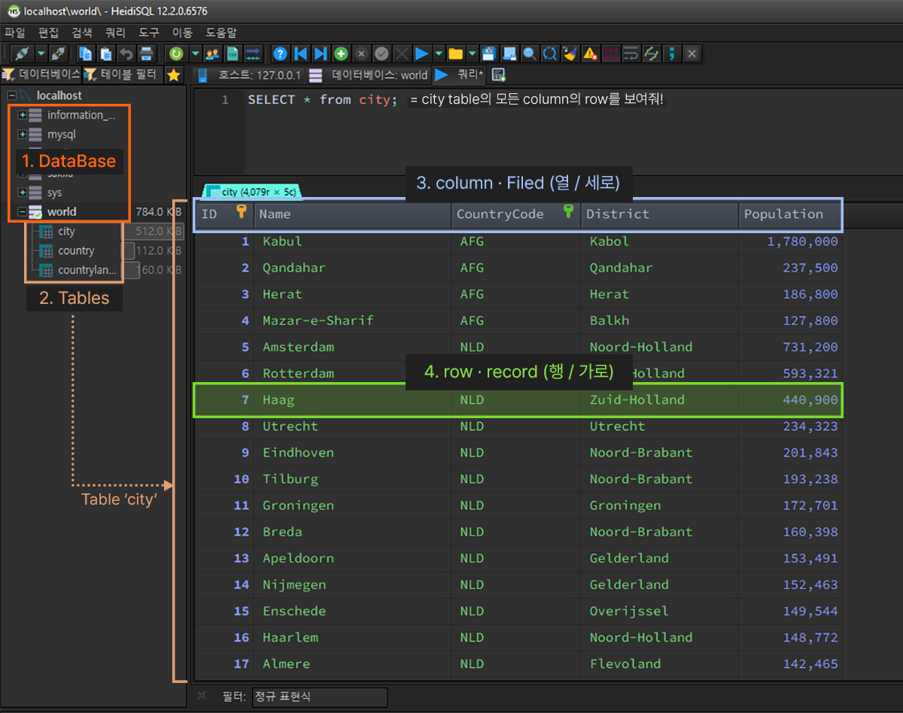

# 1. SQL - SELECT / WHERE
>  `SELECT FROM` / `WHERE` / 집계함수 / `GROUP BY` / 정렬

<br>
<br>

- ✍🏻 **Recorded Date** : 2022년 11월 16일 오후 2:31
- 💬 **Comment** : 드디어 올라가는 SQL! 참 많은걸 배웠다..!<br>사실 짧은 시간에 너무 많은걸 찍먹으로 배워서 어떤걸 우선순위에 둬야할지 모를정도😢<br>이런 고민도 다 지나가겠지..!
- 🔖 **Notion** : [노션에서 보기](https://6suk.notion.site/1-SQL-SELECT-WHERE-4067abd3f4a7463abf548da9c1d96eb4)
<br>
<br>

## 🔸 1. Data Base
- Data Base Server → Data Base → Tables<br>



<br><br>

## 🔸 2. 데이터베이스 접속 및 데이터 보기

### ◽ 데이터 베이스 접속

```sql
USE 데이터베이스명;
```

| 명령어 | 내용 |
| --- | --- |
| SHOW TABLES | 현 데이터베이스에 있는 Tables 출력 |
| DESC A | A Table의 테이블 구조 보기<br>Field / Type / Null / Key / Default / Extra … |

<br>

### ◽ `SELECT… FROM …` : 테이블 검색

- 데이터베이스 내에 **테이블 검색**

```sql
SELECT columnname FROM tablename;

SELECT * FROM city; # city 테이블에 있는 데이터 모두 가져오기
SELECT `name`, population FROM city;  # city테이블에서 name, population column만 보기
```

- `AS` : column에 별명 붙이기
- `SELECT DISTINCT column1, column2`
    
    : `column1`의 중복된 `row`값을 제외하고 출력
    
    ```sql
    SELECT **DISTINCT district** FROM city
    WHERE countrycode = 'KOR';
    
    #  city의 countrycode가 'KOR'의 **district의 값을 중복 없이** 출력
    ```
    

<br><br>

## 🔸 3. 조건 (WHERE)

```sql
SELECT column1 FROM tablename
	WHERE 조건문
	ORDER BY column1 # column1의 값을 기준으로 오름차순 정렬
	LIMIT 10; # 10개 row 출력
```

| 연산자 | 예제 | 내용 |
| --- | --- | --- |
| WHERE |  | ◽ 조건<br>◽ Group By 절 앞에 사용 |
| >, <, >=, <=, = , != | WHERE column >= 500000 | 비교연산자 |
| BETWEEN | WHERE column BETWEEN 10 AND 20 | 10과 20 사이에 포함된 row 출력<br>( 10, 20 포함 ) |
| IN | WHERE column IN ('seoul') | 이산적인 값의 조건 |
| LIKE | WHERE column LIKE ‘%단어%’ | 해당 단어가 포함된 row 출력 |

<br>

### ◽ 서브쿼리
- 쿼리문 안에 또 쿼리문이 들어 있는 것
- ex) 서울보다 인구수가 많은 city 출력
```java
SELECT * FROM city
	WHERE Population > (SELECT Population FROM city WHERE NAME = 'seoul')
```

<br><br>

## 🔸 4. 정렬

| 연산자 | 예제 | 내용 |
| --- | --- | --- |
| ORDER BY | ORDER BY column<br>ORDER BY column DESC | ◽ 오름차순으로 정렬<br>◽ 내림차순으로 정렬 |
| LIMIT | LIMIT 3<br>LIMIT 10 OFFSET 10 | ◽ 3개의 row만 출력<br>◽ 앞 10개를 건너뛰고 11~20개 row 출력 |

```sql
SELECT * FROM city
WHERE population > 1000000
AND countryCode = 'KOR'
**ORDER BY district DESC, population DESC;**

# 정렬의 기준을 2개이상 줄 수도 있다.
# 먼저 작성된 필드가 1순위이다.
```

<br><br>

## 🔸 5. 집계 함수
- **COUNT**(개수), **SUM**(총합), **AVG**(평균), **GROUP BY**(묶음)
- WHERE절에 바로 집계함수를 사용할 수 없다.
    - **GROUP BY**를 하고 **HAVING절에 집계함수**를 쓰거나
    - WHERE절에 서브쿼리에서 사용.

| 명령어 | 내용 |
| --- | --- |
| SELECT COUNT(*)<br>SELECT COUNT(column) | ◽  row 수 가져오기 (Null값 포함)<br>◽  column의 row 수 가져오기 (Null값 무시) |
| SELECT AVG(column) | ◽  평균<br>◽  숫자형 column만 사용 가능 |
| SELECT ROUND(AVG(column)) | ◽  반올림 |
| SELECT MAX(column)<br>SELECT MIN(column) | ◽  column의 최대 row<br>◽  column의 최소 row |
| SELECT SUM(column) | ◽ 더하기 |
| GROUP BY (column) | ◽ column의 중복되는 데이터를 하나로 모아줌<br>◽ 다른 집계 함수와 연계하여 사용 가능 |
| SELECT GROUP_CONCAT(column) | ◽ column의 row들을 문자열로 합칠 때 |
| HAVING | ◽ 그룹의 조건<br>◽ Group By 절 뒤에 사용 |

<br>

### ◽ GROUP BY / HAVING

- 집계 함수는 `having`절과 함께 사용할 수 있다.
- 읽기 좋게 하기 위해 별칭(Aliad) `AS` 사용

```sql
SELECT [DISTINCT] 컬럼, 그룹 함수(컬럼)
FROM 테이블명
[WHERE 조건]
[GROUP BY Group대상]
[HAVING 그룹 함수 포함 조건]
[ORDER BY 정렬대상 [ASC/DESC]]
```

```sql
# 1. 그룹핑을 하지 않았을 때,
SELECT name,SUM(Population) FROM city
WHERE CountryCode = 'KOR'
# KOR의 전체 인구 수 출력

# 2. 그룹핑 후,
SELECT name,SUM(Population) FROM city
WHERE CountryCode = 'KOR'
GROUP BY district;
# 지역별 인구 수 출력
```

```sql
# GROUP BY + HAVING
SELECT District, ROUND(AVG(Population)), COUNT(*) FROM city
WHERE CountryCode = 'KOR'
GROUP BY District
HAVING COUNT(*) >= 5;
```

<br><br><br><br>